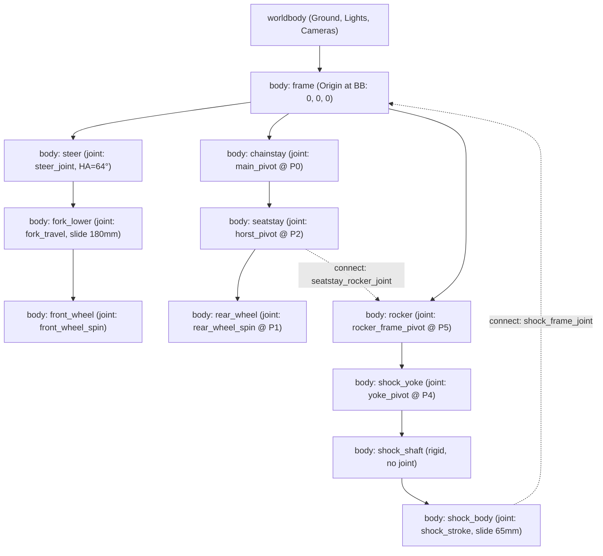

# Enduro 29" Bicycle Kinematics Engine & MuJoCo Simulation

A high-precision analytical 3D kinematic modeling engine and physically consistent **MuJoCo MJCF simulation generator** for a 180 mm travel mullet (29" front / 27.5" rear) Enduro eMTB featuring a classic **Horst-Link 4-bar suspension with shock driving yoke**.

The suspension hardpoints are **derived from a reference photograph** of a Bulls Sonic EVO by calibrated pixel measurement and constrained refit — not hand-invented. See [Provenance](#provenance-what-is-measured-and-what-is-authored) for exactly which parts of the bike are measurement and which are styling.

## Anti-wheelie research extension

For torque-policy development use [the physical research plant](docs/ANTI_WHEELIE.md),
not legacy cruise/pitch assistance. `bike-research` adds direct bounded motor
commands, articulated posture targets, grade plus roughness, zoned road materials,
causal noisy sensors, separate contact truth, energy-quality gates and repeatable
acceptance runs. The supplied offline bundle keeps all original local wheels and
adds no runtime dependencies. This is a **synthetic planar plant**, not measured
real-bicycle safety validation.

Rough-terrain front-load margin work (transmission modes, generated terrain and eval set, demand channel, batch runner) is described in [the refocus section](docs/ANTI_WHEELIE.md#refocused-plant-rough-terrain-front-load-margin).

The [0.3.0 completion guide](docs/RESEARCH_COMPLETION.md) covers nonlinear tire
curves, independent rider programs and sensor clocks, model-validity rejection,
physical TOML/road refinement, checked `bike-replay`, and offline installation.

[](https://www.python.org/)
[](https://mujoco.org/)
[](https://github.com/astral-sh/uv)
[]()
Executed regression and acceptance evidence: `verification/completion/`.

---

## Table of Contents

- [Overview & Key Features](#overview--key-features)
- [Bicycle Specifications & Geometry Summary](#bicycle-specifications--geometry-summary)
- [Provenance: What Is Measured and What Is Authored](#provenance-what-is-measured-and-what-is-authored)
  - [Reference Photograph & Hardpoint Fit](#reference-photograph--hardpoint-fit)
  - [Chainstay Conflict: Published Table Beats the Photo](#chainstay-conflict-published-table-beats-the-photo)
  - [Measured vs. Authored Frame Elements](#measured-vs-authored-frame-elements)
  - [Authored Assumptions of Ride Mode](#authored-assumptions-of-ride-mode)
  - [Render Comparison Tool](#render-comparison-tool)
- [Mathematical Formulation & Kinematic Derivations](#mathematical-formulation--kinematic-derivations)
  - [Global Coordinate System](#global-coordinate-system)
  - [Steering Geometry, Axle-to-Crown & Trail](#steering-geometry-axle-to-crown--trail)
  - [Closed-Form Analytical 4-Bar Circle-Circle Intersection](#closed-form-analytical-4-bar-circle-circle-intersection)
  - [Planar Velocity Jacobian & Instantaneous Leverage Ratio](#planar-velocity-jacobian--instantaneous-leverage-ratio)
  - [Transmission Angle & Jamming Avoidance](#transmission-angle--jamming-avoidance)
- [Hardpoint Coordinates & Link Lengths Tables](#hardpoint-coordinates--link-lengths-tables)
  - [Uncompressed State Hardpoints (0 mm Wheel Travel)](#uncompressed-state-hardpoints-0-mm-wheel-travel)
  - [Fully Compressed State Hardpoints (180 mm Wheel Travel)](#fully-compressed-state-hardpoints-180-mm-wheel-travel)
  - [Rigid Link Dimensions & Invariant Errors](#rigid-link-dimensions--invariant-errors)
- [MuJoCo MJCF Multibody Architecture (`bike_model.xml`)](#mujoco-mjcf-multibody-architecture-bike_modelxml)
  - [Multibody Tree Hierarchy](#multibody-tree-hierarchy)
  - [Loop Closure via `<connect>` Equality Constraints](#loop-closure-via-connect-equality-constraints)
  - [Actuators & Sensors](#actuators--sensors)
- [Installation & Quick Start](#installation--quick-start)
  - [Prerequisites](#prerequisites)
  - [Environment Setup via `uv`](#environment-setup-via-uv)
  - [CLI Command Execution](#cli-command-execution)
- [Interactive 2D Suspension Test Stand (`bike-playground`)](#interactive-2d-suspension-test-stand-bike-playground)
- [Ride Mode: Rolling Over a Road (`bike-ride`)](#ride-mode-rolling-over-a-road-bike-ride)
- [Automated Test Suite](#automated-test-suite)
- [Known Limitations](#known-limitations)
- [Repository Structure](#repository-structure)
- [License](#license)

---

## Overview & Key Features

Modern long-travel Enduro mountain bikes require precise kinematic balance between bump compliance, pedaling efficiency, and bottom-out resistance. This project implements a fully analytical, closed-form calculation engine that couples 3D steering frame geometry to a 4-bar Horst-Link suspension and generates production-ready MuJoCo MJCF multibody physics simulation models.

### Key Capabilities
- **Photo-Derived Hardpoints**: Every suspension pivot is measured from a calibrated reference photograph and refit under hard constraints (exact 65 mm stroke, exact 205 mm eye-to-eye, collinear shock eyelet), with per-pivot residuals recorded in `docs/reference/fitted_hardpoints.json`.
- **Zero-Approximation Kinematics**: Uses exact 2D circle-circle analytical geometry instead of numerical iteration per frame, achieving numerical link invariant conservation to $< 10^{-12}\text{ mm}$.
- **Instantaneous Virtual Work Jacobian**: Computes the exact derivative $\frac{dZ_{\text{wheel}}}{ds_{\text{shock}}}$ via planar rigid-body velocity propagation rather than finite differences.
- **Root-Bracketed Brent Travel Matching**: Enables bi-directional kinematic evaluation (Chainstay Angle $\to$ Travel or Wheel Travel $\to$ Pivot State) with machine precision.
- **Validated MuJoCo MJCF Export**: Emits complete MJCF XML models with 11 kinematic bodies, 9 joints, 2 loop-closure equality constraints, externally-driven pneumatic/damper suspension forces, visual geoms, drive/brake actuators, and a 17-channel IMU/encoder sensor suite.
- **Quantitative Fidelity Check**: `tools/render_comparison.py` renders the model into the reference photograph's own pixel frame, so frame fidelity is judged by measured registration residuals rather than by eye.
- **Full Automation via `uv`**: Ultra-fast dependency resolution, execution, and testing with standard Python tooling.

---

## Bicycle Specifications & Geometry Summary

The bicycle model corresponds to an aggressive modern mullet Enduro eMTB geometry. Every
figure below is read back from `coordinates.json` (regenerate with
`uv run bike-sim --export-json`) or from the compiled MJCF; none is hand-maintained.

| Parameter                     | Symbol / Variable                               | Value               | Unit  | Description / Engineering Rationale                                                                                                                                                                                                                   |
|-------------------------------|-------------------------------------------------|---------------------|-------|-------------------------------------------------------------------------------------------------------------------------------------------------------------------------------------------------------------------------------------------------------|
| **Reach**                     | $R$                                             | `480.0`             | mm    | Horizontal distance from Bottom Bracket (BB) to top center of head tube                                                                                                                                                                               |
| **Stack**                     | $S$                                             | `646.0`             | mm    | Vertical distance from Bottom Bracket (BB) to top center of head tube                                                                                                                                                                                 |
| **Head Tube Angle**           | $\theta_{\text{HT}}$                            | `64.0`              | deg   | Slack steering axis inclination for high-speed stability                                                                                                                                                                                              |
| **Effective Seat Angle**      | $\theta_{\text{ST}}$                            | `77.0`              | deg   | Published virtual BB → saddle-height angle. Not the drawn tube: the physical $P_{10} \to P_9$ seat tube sits at `74.476°`                                                                                                                             |
| **Bottom Bracket Drop**       | $\text{BB}_{\text{drop}}$                       | `22.5`              | mm    | Vertical drop of BB below the **front** axle plane ($Z_{\text{FA}} = +22.5\text{ mm}$)                                                                                                                                                                |
| **Wheelbase**                 | $\text{WB}$                                     | `1280.55`           | mm    | Horizontal distance between front and rear axles ($P_{\text{FA}}[X] - P_1[X]$). Chosen so the BB → rear-axle distance is exactly the published `447.50` mm chainstay                                                                                  |
| **Chainstay Length**          | $\|P_1 - \text{BB}\|$                           | `447.501`           | mm    | Published table value; overrides the reference photograph — see [Provenance](#provenance-what-is-measured-and-what-is-authored)                                                                                                                       |
| **Wheel Configuration**       | —                                               | `Mullet (MX)`       | —     | 29" Front Wheel ($R_f = 372\text{ mm}$) / 27.5" Rear Wheel ($R_r = 352\text{ mm}$)                                                                                                                                                                    |
| **Front Wheel Radius (29")**  | $R_f$                                           | `372.0`             | mm    | Outer radius of 29" front wheel with 2.4"–2.5" enduro tire (diameter $744\text{ mm}$)                                                                                                                                                                 |
| **Rear Wheel Radius (27.5")** | $R_r$                                           | `352.0`             | mm    | Outer radius of 27.5" rear wheel with 2.5"–2.6" enduro tire (diameter $704\text{ mm}$)                                                                                                                                                                |
| **Ground Plane Height**       | $Z_{\text{ground}}$                             | `-349.5`            | mm    | Flat ground contact plane in BB origin frame ($Z_{\text{FA}} - R_f = 22.5 - 372.0$)                                                                                                                                                                   |
| **Rear Axle Height**          | $Z_{\text{RA}}$                                 | `+2.5`              | mm    | Rear axle height on flat ground ($Z_{\text{ground}} + R_r = -349.5 + 352.0$)                                                                                                                                                                          |
| **Fork Travel**               | $s_{\text{fork}}$                               | `180.0`             | mm    | Telescopic fork travel along 64° steering axis                                                                                                                                                                                                        |
| **Fork Offset (Rake)**        | $k_{\text{offset}}$                             | `44.0`              | mm    | Perpendicular forward offset from steering axis to front axle                                                                                                                                                                                         |
| **Rear Wheel Travel**         | $s_{\text{wheel}}$                              | `180.0`             | mm    | Vertical displacement of rear axle ($P_1[Z]: 2.5\text{ mm} \to 182.5\text{ mm}$)                                                                                                                                                                      |
| **Shock Dimensions**          | $L_{\text{shock}} \times s_{\text{shock}}$      | `trunnion 205 x 65` | mm    | Trunnion-mount eye-to-eye length and full damper stroke (= `230 x 65` in standard-mount sizing)                                                                                                                                                       |
| **Realised Shock Stroke**     | $\Delta L_{\text{shock}}$                       | `65.000040`         | mm    | Shock travel consumed over the full $0 \to 180$ mm rear stroke; the fit constrains it to `65.000` mm                                                                                                                                                  |
| **Ground Trail**              | $T_g$                                           | `132.482`           | mm    | Horizontal distance from steering axis ground intersection to contact patch                                                                                                                                                                           |
| **Mechanical Trail**          | $T_m$                                           | `119.074`           | mm    | Perpendicular torque arm providing self-aligning stabilizing torque                                                                                                                                                                                   |
| **Axle-to-Crown**             | $\text{A2C}$                                    | `595.168`           | mm    | Rigid fork length from bottom head tube face to axle                                                                                                                                                                                                  |
| **Initial Leverage Ratio**    | $\text{LR}_0$                                   | `3.349455`          | ratio | Leverage ratio at uncompressed state (0 mm travel)                                                                                                                                                                                                    |
| **Final Leverage Ratio**      | $\text{LR}_{180}$                               | `2.411763`          | ratio | Leverage ratio at bottom-out (180 mm travel)                                                                                                                                                                                                          |
| **Suspension Progressivity**  | $(\text{LR}_0 - \text{LR}_{180}) / \text{LR}_0$ | `+27.995%`          | %     | Progressive leverage curve providing bottom-out ramp-up; $\text{LR}(x)$ is strictly monotonically decreasing over the whole stroke                                                                                                                    |
| **Rear Spring Rate**          | $k_{\text{shock}}$                              | `114600`            | N/m   | Derived, not chosen: $k = F_{\text{rear}} \, \text{LR}(54\text{ mm}) / \text{stroke}(54\text{ mm})$ with $F_{\text{rear}} = 0.65 \times 104.4\text{ kg} \times 9.81 = 665.71\text{ N}$ gives $114\,589.6$ N/m; `114600` settles at `29.998%` rear sag |
| **Total Model Mass**          | $m_{\text{bike}}$                               | `24.35`             | kg    | Compiled bare-bike mass in `bike_model.xml` and `bike_playground_stand.xml`. `BikeMassSpecs` budgets `24.40` kg; the pinned `0.05` kg gap is documented in [Known Limitations](#known-limitations)                                                    |

---

## Provenance: What Is Measured and What Is Authored

This model's suspension hardpoints are **not invented**. They were extracted from a
reference side-profile photograph of a Bulls Sonic EVO and then refit under hard
geometric constraints. Everything below states which parts of the bike are measurement
and which are styling, because the two do not carry the same authority.

### Reference Photograph & Hardpoint Fit

| Stage             | Artifact                                                                   | What it holds                                                                     |
|-------------------|----------------------------------------------------------------------------|-----------------------------------------------------------------------------------|
| Extraction        | `tools/photo_reference.py` → `docs/reference/bulls_reference_points.json`  | Pixel-to-millimetre calibration and the raw measured pivot positions              |
| Constrained refit | `tools/fit_hardpoints.py` → `docs/reference/fitted_hardpoints.json`        | The shipped hardpoint constants, fit residuals, and the resulting leverage curve  |
| Adoption          | `src/bike_sim/geometry/hardpoints.py`, `src/bike_sim/kinematics/solver.py` | The fitted constants, hard-coded; the runtime library never re-runs the optimiser |

Every pivot bolt on the reference bike is highlighted in red. `tools/photo_reference.py`
segments those clusters ($R > 110$, $R - G > 55$, $R - B > 55$, components $\ge 25$ px) and
maps them into the BB-origin frame. Calibration uses **two** anchors only: the BB cluster
as origin, and the two axle clusters as a known `1280.55` mm wheelbase. BB drop is
deliberately excluded from the scale fit, so reproducing it is an independent check — the
photograph returns `22.215` mm against the specified `22.5` mm.

`tools/fit_hardpoints.py` then runs an offline Nelder-Mead least-squares fit (14 free
parameters, 14 043 evaluations) of the pivots onto their measured positions, subject to
constraints that are never traded away:

- shock stroke over $0 \to 180$ mm of rear travel $= 65.000$ mm;
- shock eye-to-eye $\|P_7 - P_6\| = 205.0$ mm, with $P_6$ **collinear** on $P_4 \to P_7$;
- the published `447.5` mm chainstay.

Per-pivot residuals against the photograph (mm, from `docs/reference/fitted_hardpoints.json`):

| $P_0$ | $P_2$ | $P_3$ | $P_4$ | $P_5$ | $P_6$ | $P_7$ | $P_{12}$ |
|---|---|---|---|---|---|---|---|
| `0.586` | `0.195` | `0.723` | `0.731` | `0.663` | `3.085` | `2.921` | `0.013` |

$P_6$ and $P_7$ carry the largest residuals because they absorb the exact-stroke and
exact-eye-to-eye constraints; the four-bar pivots proper land inside 0.75 mm.

`scipy` is used by the offline `tools/fit_hardpoints.py` command and is declared in `pyproject.toml`.
The environment dependencies are installed with `uv sync`; the tests validate the committed
constants rather than re-running the fit.

### Chainstay Conflict: Published Table Beats the Photo

The photograph and the published geometry table disagree about the rear centre, and the
table wins:

- the photo places the rear axle at $X = -468.3$ mm (a `468.35` mm BB → axle distance);
- the published table mandates a `447.5` mm chainstay.

The rear group ($P_2$ and the dropout kink $P_{12}$) is therefore translated **forward by
21.0 mm** as a rigid body (`CHAINSTAY_SHIFT_MM` in `tools/fit_hardpoints.py`), and $P_1$ is
placed from the published wheelbase rather than fitted. The shift is X-only and
intentional.

**Consequence:** the model's rear axle deliberately does **not** sit where the photograph
shows it — it is `20.8` mm forward of the photographed position. The overlay's camera fit
is a least-squares registration over BB and both axles, so that 20.8 mm is spread across
all three anchors rather than concentrated at the rear wheel; it is the dominant term in
the residuals printed below. That is the specification asserting itself over the reference
image, not a registration error.

### The One Published Value That Is Not Held Exactly: Wheelbase

The published table lists a `1281` mm wheelbase **and** a `447.5` mm chainstay. Given the
other locked values — reach, stack, head angle, fork offset, BB drop and the mullet rear
radius — the two are not simultaneously satisfiable. Reach, stack and head angle fully
determine the front axle at $X = 833.056$ mm, and an exact `447.5` mm chainstay puts the
rear axle at $X = -447.494$ mm, which leaves a wheelbase of `1280.55` mm. The published
figures are `0.45` mm apart.

**The chainstay is held exact and the wheelbase absorbs the difference.** `BikeSpecs.wheelbase`
is therefore `1280.55`, not `1281`, and `tools/photo_reference.py` calibrates the photograph
against that same `1280.55` mm axle span, so the scale factor and the model agree.

This is the only entry in the published table that the model does not reproduce to the digit,
and 0.45 mm is roughly a quarter of the `1.62` mm/px photo resolution — it is below what the
reference image could resolve either way. It is recorded here because a reader comparing the
model against the published table would otherwise find the discrepancy and have no way to
tell whether it was a decision or a defect.

### Measured vs. Authored Frame Elements

Be precise about which is which — this is not a blanket claim about "the frame".

**Measured from the photograph:**

- all eight suspension pivots ($P_0$, $P_2$, $P_3$, $P_4$, $P_5$, $P_6$, $P_7$, $P_{12}$);
- the shock axis and its trunnion position;
- the seat tube, including the height $Z \approx 258$ mm at which it dies into the frame
  casting (the silhouette width steps from 29 mm to 68 mm there — which is why the model
  needs no split-strut cage to clear the rocker);
- the seatpost axis (`72.0°` from horizontal, independently re-derived at `71.1°` by
  least squares over 98 image rows) and saddle height (saddle top $Z = 690.0$ mm median
  over the 154 columns spanning the shell);
- the down-tube envelope, from two horizontal silhouette bands at $Z = 255$ mm
  ($X \in [150, 266]$) and $Z = 323$ mm ($X \in [208, 305]$).

**Authored styling, not measurement:**

- the front-triangle tube shapes — top tube, top-tube bridge, head tube capsule, the
  frame casting around $P_5$, the seat gusset and the $P_7$ junction. The reference bike is
  white on a white background in this region and cannot be segmented reliably, so these
  geoms were shaped by eye to a plausible silhouette;
- the hardcoded frame reference points $P_8$ (top-tube kink) and $P_{10}$ (seat-tube
  junction);
- the model's livery. It is intentionally not the real bike's paint scheme;
- the crankset: 165 mm arms at 3 and 9 o'clock with platform pedals, rigid with the frame,
  splitting the `0.85` kg `crank_pedals_mass` as spindle 0.10, arms 2 × 0.20, pedals
  2 × 0.175 kg;
- the seated rider's saddle height: it leaves the photograph's 690 mm and follows the
  rider's inseam (LeMond, `0.883 ×`), +36 mm for the default 1.80 m rider. The `none` and
  `lumped` variants keep the photograph's saddle.

### Authored Assumptions of Ride Mode

Ride mode adds a layer that is **authored throughout** — nothing in it is measured from
the reference bike, and `docs/RIDE.md` §11–§12 lists each item with its justification:

- the track layouts: `enduro_aggressive` is a designed sequence of features, and the
  `road_*` presets are procedurally generated from a fixed seed with authored densities
  and size ranges (potholes 40–120 mm deep and 0.3–0.8 m long on `road_worn`, etc.);
- rolling resistance `Crr = 0.015`, applied as `Crr·N·r` against the instantaneous
  vertical contact load;
- the tyre as a massless contact sphere with `solref = −130000 −800` (130 N/mm,
  800 N·s/m) and friction `1.2`; there is no tyre slip model;
- the virtual rider moment: a PD moment on chassis pitch capped at ±80 N·m, active only
  while both wheels are airborne, with its angular impulse and work logged because it
  violates conservation of angular momentum;
- the seated rider's authored parts: leg (5 Hz) and arm (4 Hz) path resonances, hip 60 mm
  above the saddle, ankle 115 mm above the pedal, a 15° elbow, inseam = 0.47 × stature, a
  0.4 kg helmet; its literature parts (de Leva 1996 segment masses and lengths, LeMond's
  0.883 × inseam saddle height, Kumar & Saran 2019 saddle contact, the 4–6 Hz / ~1.5 ×
  seated-body apparent-mass peak, the 55 / 33 / 12 % saddle / pedal / bar split
  extrapolated from Carahalios 2015) are listed with sources in `docs/RIDE.md` §7;
- the 165 mm horizontal cranks and platform pedals, rigid with the frame (no drivetrain);
- crash thresholds: pitch beyond 60° or handlebar–ground contact;
- the 10-step (5 ms) contact debounce that bridges MuJoCo's sphere–heightfield dropouts;
- omitted aerodynamic drag (wheel power reads ~90 W low at 25 km/h) and omitted
  drivetrain (torque applied at the wheel);
- the summary's 100 Hz low-pass on accelerations, chosen to remove 1–2 ms solver
  transients while keeping every band the suspension works in.

### Render Comparison Tool

```bash
uv run --with pillow python -m tools.render_comparison
```

Writes two files:

| File                            | Purpose                                                                                                 |
|---------------------------------|---------------------------------------------------------------------------------------------------------|
| `docs/reference/comparison.png` | Photograph left, render right, captioned                                                                |
| `docs/reference/overlay.png`    | **The diagnostic one.** Render composited over the photograph at 50 % opacity in the *same* pixel frame |

Alignment is quantitative, not eyeballed. The camera is switched to orthographic, `fovy` is
pinned so one rendered pixel spans exactly one photograph pixel, and `lookat` is the
least-squares translation registering the model's BB and both axles onto their measured
photo pixels. The three residuals are asserted below tolerance and printed on every run
(currently BB `8.65` px, rear axle `4.91` px, front axle `4.50` px).

Use `overlay.png` to judge fidelity. The side-by-side in `comparison.png` reads as a
*different bike* at a glance because the model's livery is deliberately not the real bike's
— that is a paint difference, not a geometry difference.

> **Note:** comparison and overlay PNGs are ignored by Git and must be regenerated with the command above.
> CLI plots, JSON exports, and MJCF files are also ignored under `output/`.

---

## Mathematical Formulation & Kinematic Derivations

### Global Coordinate System

All 3D geometric entities, hardpoints, and simulation assets are defined in standard MuJoCo coordinates:
- **Origin $\mathbf{O} = (0, 0, 0)$**: Center of the Bottom Bracket (BB).
- **$+X$ Axis**: Horizontal, pointing forward towards the front wheel.
- **$+Y$ Axis**: Lateral, pointing leftward (symmetry plane is $Y = 0$).
- **$+Z$ Axis**: Vertical, pointing upward against gravity.

```
       +Z (Upward)
        ^
        |     [P11: Reach, Stack]
        |        \
        |         \ (Steer Axis 64°)
        |          \
        |           \
  [P1: RA]           +------> +X (Forward)
        \           /  [BB: Origin (0,0,0)]
         \_________/
            [P0]
```

---

### Steering Geometry, Axle-to-Crown & Trail

Let $\theta = 64.0^\circ$ be the head tube angle. The unit vector pointing upward along the steering axis is:

$$\mathbf{u}_{\text{steer}} = \begin{pmatrix} -\cos\theta \\ 0 \\ \sin\theta \end{pmatrix} \approx \begin{pmatrix} -0.438371 \\ 0 \\ 0.898794 \end{pmatrix}$$

The downward steering vector is $\mathbf{d}_{\text{steer}} = -\mathbf{u}_{\text{steer}} = (\cos\theta, 0, -\sin\theta)^T$.

1. **Top Headtube Hardpoint $P_{11}$**:
   $$\mathbf{P}_{11} = \begin{pmatrix} \text{Reach} \\ 0 \\ \text{Stack} \end{pmatrix} = \begin{pmatrix} 480.000 \\ 0.000 \\ 646.000 \end{pmatrix}\text{ mm}$$

2. **Bottom Headtube Hardpoint $P_{\text{HT\_bot}}$**:
   Given headtube length $L_{\text{HT}} = 120.0\text{ mm}$:
   $$\mathbf{P}_{\text{HT\_bot}} = \mathbf{P}_{11} + L_{\text{HT}} \begin{pmatrix} \cos\theta \\ 0 \\ -\sin\theta \end{pmatrix} = \begin{pmatrix} 480 + 120\cos 64^\circ \\ 0 \\ 646 - 120\sin 64^\circ \end{pmatrix} = \begin{pmatrix} 532.605 \\ 0.000 \\ 538.145 \end{pmatrix}\text{ mm}$$

3. **Front Axle $P_{\text{FA}}$**:
   The front axle height is located at $Z = \text{BB}_{\text{drop}} = 22.5\text{ mm}$. The steering line intersects the axle horizontal plane at:
   $$X_{\text{axis}} = \text{Reach} + \frac{\text{Stack} - \text{BB}_{\text{drop}}}{\tan\theta} = 480.0 + \frac{646.0 - 22.5}{\tan 64.0^\circ} = 784.101\text{ mm}$$
   Accounting for fork rake (offset) $k_{\text{offset}} = 44.0\text{ mm}$ along the normal to the steerer:
   $$X_{\text{FA}} = X_{\text{axis}} + \frac{k_{\text{offset}}}{\sin\theta} = 784.101 + \frac{44.0}{\sin 64.0^\circ} = 833.056\text{ mm}$$
   $$\mathbf{P}_{\text{FA}} = \begin{pmatrix} 833.056 \\ 0.000 \\ 22.500 \end{pmatrix}\text{ mm}$$

4. **Rear Axle $P_1$ (Uncompressed)**:
   The bike is a mullet, so the rear axle sits at $Z_{\text{ground}} + R_r = -349.5 + 352.0 = 2.5\text{ mm}$, **not** at $\text{BB}_{\text{drop}}$:
   $$\mathbf{P}_1 = \begin{pmatrix} X_{\text{FA}} - \text{Wheelbase} \\ 0 \\ Z_{\text{ground}} + R_r \end{pmatrix} = \begin{pmatrix} 833.056 - 1280.55 \\ 0 \\ 2.5 \end{pmatrix} = \begin{pmatrix} -447.494 \\ 0.000 \\ 2.500 \end{pmatrix}\text{ mm}$$
   The resulting BB → rear-axle distance is $\|\mathbf{P}_1\| = 447.501\text{ mm}$, i.e. the published `447.50` mm chainstay; the `1280.55` mm wheelbase was chosen to make that exact.

5. **Ground Trail & Mechanical Trail**:
   Ground contact elevation is $Z_{\text{ground}} = -R_f + \text{BB}_{\text{drop}} = -372.0 + 22.5 = -349.5\text{ mm}$.
   The steer axis intersects ground level at:
   $$X_g = \text{Reach} + \frac{\text{Stack} - Z_{\text{ground}}}{\tan\theta} = 480.0 + \frac{646.0 - (-349.5)}{\tan 64.0^\circ} = 965.538\text{ mm}$$
   $$\text{Ground Trail } T_g = X_g - X_{\text{FA}} = 965.538 - 833.056 = 132.482\text{ mm}$$
   $$\text{Mechanical Trail } T_m = T_g \sin\theta = 132.482 \times \sin 64.0^\circ = 119.074\text{ mm}$$
   $$\text{Axle-to-Crown } \text{A2C} = (\mathbf{P}_{\text{FA}} - \mathbf{P}_{\text{HT\_bot}}) \cdot \mathbf{d}_{\text{steer}} = 595.168\text{ mm}$$

---

### Closed-Form Analytical 4-Bar Circle-Circle Intersection

The rear suspension consists of:
1. **Chainstay Link** rotating around fixed pivot $P_0$ on the frame with length $L_{\text{cs}} = \|\mathbf{P}_2 - \mathbf{P}_0\| = 338.6850\text{ mm}$.
2. **Seatstay Link** coupler between Horst pivot $P_2$ and rocker pivot $P_3$ with length $L_{\text{ss}} = \|\mathbf{P}_3 - \mathbf{P}_2\| = 375.1522\text{ mm}$.
3. **Rocker Link** triangle rotating around fixed frame pivot $P_5$ with arm radius $R_{53} = \|\mathbf{P}_3 - \mathbf{P}_5\| = 115.1847\text{ mm}$.

```
                 [P7: Shock Upper]
                    /
                   / (Damper Line)
                  /
             [P6: Eyelet]
                /
     [P4: Yoke] /
        \      /
         \    /
     [P5: Rocker] === [P3: Rocker-SS]
                       \
                        \
                         \ (Seatstay L_ss)
                          \
        [P0: Main]         \
           \                \
            \ (Chainstay)    \
             \                \
              [P2: Horst] === [P1: Rear Axle]
```

For any chainstay angle $\theta_{\text{cs}}$ relative to $+X$:
$$\mathbf{P}_2 = \begin{pmatrix} X_0 + L_{\text{cs}} \cos\theta_{\text{cs}} \\ 0 \\ Z_0 + L_{\text{cs}} \sin\theta_{\text{cs}} \end{pmatrix}$$

Pivot $P_3$ is the intersection of Circle 1 $(\mathbf{P}_2, L_{\text{ss}})$ and Circle 2 $(\mathbf{P}_5, R_{53})$ in the $XZ$ plane:
$$\mathbf{d}_{25} = \mathbf{P}_5 - \mathbf{P}_2, \quad d = \|\mathbf{d}_{25}\|, \quad \hat{\mathbf{u}} = \frac{\mathbf{d}_{25}}{d}, \quad \hat{\mathbf{n}} = \begin{pmatrix} -u_z \\ u_x \end{pmatrix}$$
$$a = \frac{L_{\text{ss}}^2 - R_{53}^2 + d^2}{2d}, \quad h = \sqrt{L_{\text{ss}}^2 - a^2}$$
$$\mathbf{P}_{3}^{(1,2)} = \mathbf{P}_2 + a \hat{\mathbf{u}} \pm h \hat{\mathbf{n}}$$

The physically active branch is the upper solution ($+h \hat{\mathbf{n}}$).

Rigid body transformations then compute:
- **Rocker-Yoke Pivot $P_4$**: Rotated about $P_5$ by fixed angle $\beta_{\text{rocker}} = \angle(P_4 - P_5) - \angle(P_3 - P_5)$.
- **Rear Axle $P_1$**: Attached rigidly to seatstay link $P_2 \to P_3$ by angle $\gamma_{\text{ra}} = \angle(P_1 - P_2) - \angle(P_3 - P_2)$.
- **Shock Eyelet $P_6$**: Positioned along the line of action $\mathbf{P}_4 \to \mathbf{P}_7$ at fixed yoke distance $L_{\text{yoke}} = 94.7814\text{ mm}$. Collinearity is a hard constraint of the hardpoint fit, not an approximation — a non-collinear $P_6$ is not a geometry this model can represent:
  $$\hat{\mathbf{u}}_{47} = \frac{\mathbf{P}_7 - \mathbf{P}_4}{\|\mathbf{P}_7 - \mathbf{P}_4\|}, \quad \mathbf{P}_6 = \mathbf{P}_4 + L_{\text{yoke}} \hat{\mathbf{u}}_{47}$$

---

### Planar Velocity Jacobian & Instantaneous Leverage Ratio

Rather than using numerical differences $\frac{\Delta Z}{\Delta s}$, the exact leverage ratio is computed analytically via 2D planar velocity Jacobian kinematics.

Let $\dot{\theta}_{\text{cs}} = 1\text{ rad/s}$ be a virtual unit angular velocity of the chainstay:
$$\mathbf{v}_2 = \dot{\theta}_{\text{cs}} (\hat{\mathbf{k}} \times \mathbf{r}_{02}) = \begin{pmatrix} -L_{\text{cs}}\sin\theta_{\text{cs}} \\ L_{\text{cs}}\cos\theta_{\text{cs}} \end{pmatrix}$$

Velocity of pivot $P_3$ expressed from rocker rotation ($\omega_{\text{roc}}$) and seatstay rotation ($\omega_{\text{ss}}$):
$$\mathbf{v}_3 = \mathbf{v}_2 + \omega_{\text{ss}} (\hat{\mathbf{k}} \times \mathbf{r}_{23}) = \omega_{\text{roc}} (\hat{\mathbf{k}} \times \mathbf{r}_{53})$$

Taking the dot product with $\mathbf{r}_{23}$ eliminates the unknown $\omega_{\text{ss}}$:
$$\omega_{\text{roc}} [(\hat{\mathbf{k}} \times \mathbf{r}_{53}) \cdot \mathbf{r}_{23}] = \mathbf{v}_2 \cdot \mathbf{r}_{23}$$
$$\omega_{\text{roc}} = \frac{\mathbf{v}_2 \cdot \mathbf{r}_{23}}{-r_{53,z} r_{23,x} + r_{53,x} r_{23,z}}$$

With $\omega_{\text{roc}}$ known:
$$\mathbf{v}_3 = \omega_{\text{roc}} \begin{pmatrix} -r_{53,z} \\ r_{53,x} \end{pmatrix}, \quad \omega_{\text{ss}} = \frac{-(\mathbf{v}_3 - \mathbf{v}_2)_x r_{23,z} + (\mathbf{v}_3 - \mathbf{v}_2)_z r_{23,x}}{L_{\text{ss}}^2}$$
$$\mathbf{v}_{\text{RA}} = \mathbf{v}_2 + \omega_{\text{ss}} (\hat{\mathbf{k}} \times \mathbf{r}_{21}) = \begin{pmatrix} v_{2,x} - \omega_{\text{ss}} r_{21,z} \\ v_{2,z} + \omega_{\text{ss}} r_{21,x} \end{pmatrix}$$
$$\mathbf{v}_4 = \omega_{\text{roc}} (\hat{\mathbf{k}} \times \mathbf{r}_{54}) = \omega_{\text{roc}} \begin{pmatrix} -r_{54,z} \\ r_{54,x} \end{pmatrix}$$

The shock stroke compression velocity is the projection of $\mathbf{v}_4$ onto the line of action $\hat{\mathbf{u}}_{47}$:
$$\dot{s}_{\text{shock}} = \hat{\mathbf{u}}_{47} \cdot \mathbf{v}_4$$

The instantaneous leverage ratio is:
$$\text{LR}(t) = \frac{\dot{Z}_{\text{RA}}}{\dot{s}_{\text{shock}}} = \frac{v_{\text{RA}, z}}{\hat{\mathbf{u}}_{47} \cdot \mathbf{v}_4}$$

---

### Transmission Angle & Jamming Avoidance

The transmission angle $\mu(t)$ between the coupler link ($P_2 \to P_3$) and the output rocker arm ($P_5 \to P_3$) governs torque transmission quality:
$$\cos\mu = \frac{\mathbf{r}_{23} \cdot \mathbf{r}_{53}}{\|\mathbf{r}_{23}\| \|\mathbf{r}_{53}\|}, \quad \mu = \arccos(\cos\mu)$$

- **Safe engineering range**: $50.0^\circ \le \mu \le 140.0^\circ$.
- **Model behavior**: Starts at $\mu = 133.943^\circ$ (uncompressed) and transitions monotonically to $\mu = 98.404^\circ$ (fully compressed). Sampled at 2001 points over the stroke, $\mu$ never leaves $[98.404^\circ, 133.943^\circ]$ — comfortably inside the safe band, so the linkage is immune to toggle lock, dead points, and mechanical jamming throughout its entire travel.

---

## Hardpoint Coordinates & Link Lengths Tables

All coordinates below are read back from `coordinates.json`. The eight linkage pivots
($P_0$, $P_2$–$P_7$, $P_{12}$) are photo-derived; $P_8$–$P_{11}$ and $P_{\text{HT\_bot}}$ are
frame reference points — see [Provenance](#provenance-what-is-measured-and-what-is-authored).

### Uncompressed State Hardpoints (0 mm Wheel Travel)

| Point | Description | $X$ (mm) | $Y$ (mm) | $Z$ (mm) | $X$ (m) | $Y$ (m) | $Z$ (m) |
|---|---|---|---|---|---|---|---|
| **$P_0$** | Main Pivot (Frame / Chainstay) | `-44.902` | `0.000` | `+46.393` | `-0.044902` | `0.000000` | `+0.046393` |
| **$P_1$** | Rear Wheel Axle ($R_r = 352\text{ mm}$) | `-447.494` | `0.000` | `+2.500` | `-0.447494` | `0.000000` | `+0.002500` |
| **$P_2$** | Horst Pivot (Chainstay / Seatstay) | `-379.119` | `0.000` | `-8.442` | `-0.379119` | `0.000000` | `-0.008442` |
| **$P_3$** | Seatstay-Rocker Pivot | `-71.715` | `0.000` | `+206.598` | `-0.071716` | `0.000000` | `+0.206598` |
| **$P_4$** | Rocker-Yoke Pivot | `-38.546` | `0.000` | `+191.463` | `-0.038546` | `0.000000` | `+0.191463` |
| **$P_5$** | Rocker Frame Pivot (Seat Tube) | `+41.321` | `0.000` | `+184.457` | `+0.041321` | `0.000000` | `+0.184457` |
| **$P_6$** | Shock Lower Eyelet (shaft end) | `+28.408` | `0.000` | `+258.550` | `+0.028408` | `0.000000` | `+0.258550` |
| **$P_7$** | Shock Upper Mount / Trunnion (Frame) | `+173.221` | `0.000` | `+403.651` | `+0.173221` | `0.000000` | `+0.403651` |
| **$P_{12}$** | Dropout Upper Kink (Seatstay) | `-414.001` | `0.000` | `+59.987` | `-0.414001` | `0.000000` | `+0.059987` |
| **$P_8$** | Top Tube Kink (frame reference) | `+410.000` | `0.000` | `+635.000` | `+0.410000` | `0.000000` | `+0.635000` |
| **$P_9$** | Seatpost Clamp / Collar | `-85.000` | `0.000` | `+490.000` | `-0.085000` | `0.000000` | `+0.490000` |
| **$P_{10}$** | Seat Tube Junction | `-60.000` | `0.000` | `+400.000` | `-0.060000` | `0.000000` | `+0.400000` |
| **$P_{11}$** | Headtube Top (Reach, Stack) | `+480.000` | `0.000` | `+646.000` | `+0.480000` | `0.000000` | `+0.646000` |
| **$P_{\text{HT\_bot}}$** | Headtube Bottom | `+532.605` | `0.000` | `+538.145` | `+0.532605` | `0.000000` | `+0.538145` |
| **$P_{\text{FA}}$** | Front Wheel Axle ($R_f = 372\text{ mm}$) | `+833.056` | `0.000` | `+22.500` | `+0.833056` | `0.000000` | `+0.022500` |
| **$\text{BB}$** | Bottom Bracket Origin (0,0,0) | `0.000` | `0.000` | `0.000` | `0.000000` | `0.000000` | `0.000000` |

Note that $P_2$ sits **below** the BB plane ($Z = -8.442$ mm) and $P_0$ is **behind** it
($X = -44.902$ mm). Both are measurements, not modelling choices.

---

### Fully Compressed State Hardpoints (180 mm Wheel Travel)

| Point | Description | $X$ (mm) | $Y$ (mm) | $Z$ (mm) | $\Delta X$ (mm) | $\Delta Z$ (mm) |
|---|---|---|---|---|---|---|
| **$P_0$** | Main Pivot (Frame / Chainstay) | `-44.902` | `0.000` | `+46.393` | `+0.000` | `+0.000` |
| **$P_1$** | Rear Wheel Axle | `-429.222` | `0.000` | `+182.500` | `+18.272` | `+180.000` |
| **$P_2$** | Horst Pivot (Chainstay / Seatstay) | `-365.805` | `0.000` | `+154.693` | `+13.314` | `+163.135` |
| **$P_3$** | Seatstay-Rocker Pivot | `-14.159` | `0.000` | `+285.400` | `+57.557` | `+78.801` |
| **$P_4$** | Rocker-Yoke Pivot | `-4.508` | `0.000` | `+250.240` | `+34.038` | `+58.778` |
| **$P_5$** | Rocker Frame Pivot (Seat Tube) | `+41.321` | `0.000` | `+184.457` | `+0.000` | `+0.000` |
| **$P_6$** | Shock Lower Eyelet (shaft end) | `+67.241` | `0.000` | `+312.172` | `+38.833` | `+53.623` |
| **$P_7$** | Shock Upper Mount / Trunnion (Frame) | `+173.221` | `0.000` | `+403.651` | `+0.000` | `+0.000` |
| **$P_{12}$** | Dropout Upper Kink (Seatstay) | `-382.332` | `0.000` | `+229.701` | `+31.668` | `+169.714` |
| **$P_8$** | Top Tube Kink (frame reference) | `+410.000` | `0.000` | `+635.000` | `+0.000` | `+0.000` |
| **$P_9$** | Seatpost Clamp / Collar | `-85.000` | `0.000` | `+490.000` | `+0.000` | `+0.000` |
| **$P_{10}$** | Seat Tube Junction | `-60.000` | `0.000` | `+400.000` | `+0.000` | `+0.000` |
| **$P_{11}$** | Headtube Top (Reach, Stack) | `+480.000` | `0.000` | `+646.000` | `+0.000` | `+0.000` |
| **$P_{\text{HT\_bot}}$** | Headtube Bottom | `+532.605` | `0.000` | `+538.145` | `+0.000` | `+0.000` |
| **$P_{\text{FA}}$** | Front Wheel Axle | `+833.056` | `0.000` | `+22.500` | `+0.000` | `+0.000` |
| **$\text{BB}$** | Bottom Bracket Origin (0,0,0) | `0.000` | `0.000` | `0.000` | `0.000` | `0.000` |

The rear axle's horizontal excursion is not monotonic: it moves rearward to a minimum of
$X = -451.030$ mm at 51.84 mm of travel, then forward, ending 18.272 mm ahead of its
uncompressed position at bottom-out.

---

### Rigid Link Dimensions & Invariant Errors

The closed-form solver conserves rigid body distances across the entire travel stroke. The
error column is the maximum absolute deviation from the nominal length, sampled at 2001
points over $0 \to 180$ mm.

| Rigid Link Entity | Mathematical Definition | Nominal Dimension (mm) | Max Trajectory Error (mm) |
|---|---|---|---|
| **Chainstay Link** | $\|\mathbf{P}_2 - \mathbf{P}_0\|$ | `338.6850` | $5.7 \times 10^{-14}$ |
| **Seatstay Link** | $\|\mathbf{P}_3 - \mathbf{P}_2\|$ | `375.1522` | $1.1 \times 10^{-13}$ |
| **Rocker Upper Arm** | $\|\mathbf{P}_3 - \mathbf{P}_5\|$ | `115.1847` | $5.8 \times 10^{-13}$ |
| **Rocker Lower Arm** | $\|\mathbf{P}_4 - \mathbf{P}_5\|$ | `80.1736` | $2.8 \times 10^{-14}$ |
| **Rocker Span** | $\|\mathbf{P}_4 - \mathbf{P}_3\|$ | `36.4599` | $5.5 \times 10^{-13}$ |
| **Rear Axle Offset** | $\|\mathbf{P}_1 - \mathbf{P}_2\|$ | `69.2456` | $5.7 \times 10^{-14}$ |
| **Dropout Front Edge** | $\|\mathbf{P}_{12} - \mathbf{P}_2\|$ | `76.8068` | $5.7 \times 10^{-14}$ |
| **Dropout Height** | $\|\mathbf{P}_1 - \mathbf{P}_{12}\|$ | `66.5324` | $5.7 \times 10^{-14}$ |
| **Seatstay Tube** | $\|\mathbf{P}_{12} - \mathbf{P}_3\|$ | `372.3629` | $1.1 \times 10^{-13}$ |
| **Shock Yoke Length** | $\|\mathbf{P}_6 - \mathbf{P}_4\|$ | `94.7814` | $5.7 \times 10^{-14}$ |
| **Trunnion Eye-to-Eye ($0\text{ mm}$)** | $\|\mathbf{P}_7 - \mathbf{P}_6(0)\|$ | `205.000000` | constrained exactly |
| **Trunnion Eye-to-Eye ($180\text{ mm}$)** | $\|\mathbf{P}_7 - \mathbf{P}_6(180)\|$ | `139.999960` | constrained exactly |
| **Full Damper Stroke** | $L_{\text{shock}}(0) - L_{\text{shock}}(180)$ | `65.000040` | $4.0 \times 10^{-5}$ vs. the `65.000` mm target |

Worst link error anywhere on the trajectory: $3.7 \times 10^{-13}\text{ mm}$.

---

## MuJoCo MJCF Multibody Architecture (`bike_model.xml`)

### Multibody Tree Hierarchy

The multibody kinematic tree generated by `src/bike_sim/mujoco/builder.py` is configured as a forward kinematic tree
with equality loop closures:



### 11 Kinematic Bodies & 9 Degrees of Freedom

The damper is split into two bodies: `shock_shaft` rides rigidly with the yoke, and
`shock_body` slides along it. Only `shock_body` carries a joint, so the DOF count is
unchanged at 9. `shock_body`'s trunnion bosses bolt into `geom_frame_junction`, frame
material at $P_7$ — there is no floating standoff bracket.

| Body Name | Parent Body | Joint Name | Joint Type | Axis / Direction | Mass (kg) | Stiffness / Damping |
|---|---|---|---|---|---|---|
| `frame` | `worldbody` | *(Fixed Root)* | None | — | `12.10` | — |
| `steer` | `frame` | `steer_joint` | `hinge` | Head Angle ($64.0^\circ$) Upward | `1.95` | $d = 1.5\text{ Nms/rad}$, range $\pm 60^\circ$ |
| `fork_lower` | `steer` | `fork_travel` | `slide` | Along Fork Axis ($180\text{ mm}$) | `1.50` | $k = 0, d = 0$ — see note |
| `front_wheel` | `fork_lower` | `front_wheel_spin` | `hinge` | `(0, 1, 0)` Pitch Spin | `2.40` | $d = 0.01\text{ Nms/rad}$ |
| `chainstay` | `frame` | `main_pivot` | `hinge` | `(0, 1, 0)` Pitch Pivot | `1.25` | $d = 0.5\text{ Nms/rad}$ |
| `seatstay` | `chainstay` | `horst_pivot` | `hinge` | `(0, 1, 0)` Pitch Pivot | `1.05` | $d = 0.3\text{ Nms/rad}$ |
| `rear_wheel` | `seatstay` | `rear_wheel_spin` | `hinge` | `(0, 1, 0)` Pitch Spin | `2.80` | $d = 0.01\text{ Nms/rad}$ |
| `rocker` | `frame` | `rocker_frame_pivot`| `hinge` | `(0, 1, 0)` Pitch Pivot | `0.40` | $d = 0.3\text{ Nms/rad}$ |
| `shock_yoke` | `rocker` | `yoke_pivot` | `hinge` | `(0, 1, 0)` Pitch Pivot | `0.30` | $d = 0.2\text{ Nms/rad}$ |
| `shock_shaft` | `shock_yoke` | *(rigid)* | None | — | `0.20` | — |
| `shock_body` | `shock_shaft`| `shock_stroke` | `slide` | Along Damper Axis ($65\text{ mm}$) | `0.40` | $k = 0, d = 0$ — see note |
| | | | | **Total** | **`24.35`** | |

> **Suspension springs are not MJCF joint springs.** Both `fork_travel` and `shock_stroke`
> are exported with `stiffness="0" damping="0" springref="0"`. The fork's pneumatic curve
> (`src/bike_sim/physics/air_spring.py`) and both dampers' click-configurable force curves
> (`src/bike_sim/physics/damper.py`) are applied by `src/bike_sim/sim/playground.py` every
> step. The published `shock_stiffness = 114600` N/m is the linear rear rate that tuning
> chain is derived against, not an attribute in the XML.

> **Timestep.** Stand and playground modes compile at `timestep = 0.001` s, ride mode at
> `0.0005` s, and standard mode at `0.002` s. Stand mode uses very stiff position servos
> ($k_p = 150000$, $k_v = 5000$); its per-mode timestep is set in
> `src/bike_sim/mujoco/builder.py`. Note that the instability there is a resonance, not a threshold —
> 1.75 ms fails where 1.50 ms and 2.00 ms pass.

---

### Loop Closure via `<connect>` Equality Constraints

MuJoCo evaluates closed kinematic chains using smooth bilateral equality constraints. The model defines two 3D spherical loop-closure connects:

```xml
<equality>
  <!-- 1. Closes the Horst-link 4-bar loop at seatstay-rocker pivot P3 -->
  <connect name="seatstay_rocker_joint" site1="site_P3_ss" site2="site_P3_rocker"
           solref="0.0005 1" solimp="0.99 0.999 0.0001 0.5 2"/>

  <!-- 2. Closes the shock damper loop to the front triangle upper mount P7 -->
  <connect name="shock_frame_joint" site1="site_P7_shock" site2="site_P7"
           solref="0.0005 1" solimp="0.99 0.999 0.0001 0.5 2"/>
</equality>
```

- **Nominal Assembly Closure**: The hardpoints `src/bike_sim/kinematics/solver.py` computes close the loops
  to $< 10^{-12}\text{ mm}$ analytically. The MJCF, however, writes coordinates at $10^{-6}$ m
  precision, so the *compiled* model's nominal residuals (measured with `mj_forward` at
  `qpos0`) are $1 \times 10^{-3}\text{ mm}$ at $P_3$ and exactly $0$ at $P_7$ — the quantisation
  floor of the file format, not a solver error. That is small enough for immediate
  convergence without initial strain energy.

---

### Actuators & Sensors

The MJCF XML model contains realistic actuators and state-feedback sensors for control and reinforcement learning:

#### Actuators
- **`steer_servo`**: Position servo actuator on `steer_joint` with $k_p = 150, k_v = 15, \text{ctrlrange} = [-45^\circ, +45^\circ]$.
- **`rear_drive_motor`**: Torque motor on `rear_wheel_spin` with $\tau \in [-150, +150]\text{ Nm}$.
- **`front_brake`**: Unidirectional braking torque actuator on `front_wheel_spin` with $\tau \in [-200, 0]\text{ Nm}$.
- **`rear_brake`**: Unidirectional braking torque actuator on `rear_wheel_spin` with $\tau \in [-200, 0]\text{ Nm}$.

#### Sensors (17 total)
- **Suspension Travel / Stroke**: `sensor_shock_stroke`, `sensor_shock_velocity`, `sensor_fork_travel`, `sensor_fork_velocity`.
- **Linkage Angles**: `sensor_steer_angle`, `sensor_steer_velocity`, `sensor_chainstay_angle`, `sensor_horst_angle`, `sensor_rocker_angle`, `sensor_yoke_angle`.
- **Wheel Telemetry**: `sensor_front_wheel_speed`, `sensor_rear_wheel_speed`.
- **Chassis IMU**: `sensor_frame_accel` (3D accelerometer at BB), `sensor_frame_gyro` (3D gyroscope at BB).
- **Axle Trajectory Tracking**: `sensor_front_axle_pos` (3D site position), `sensor_rear_axle_pos` (3D site position).
- **Mass Tracking**: `sensor_subtree_com` (whole-bike centre of mass).

---

## Installation & Quick Start

### Prerequisites

- Python $\ge$ 3.13 (required by `pyproject.toml`)
- [`uv`](https://github.com/astral-sh/uv)

### Environment Setup via `uv`

From the repository root, create/synchronize the virtual environment and install the project:

```bash
uv sync
```

---

### CLI Command Execution

The package installs four commands: `bike-sim` for analysis and exports, `bike-export` for model/data exports,
`bike-playground` for the interactive test stand, and `bike-ride` for ride mode (rolling over a road, interactive or
headless with telemetry). With no flags, `bike-sim` prints geometry tables and generates plots.
`--all` also exports JSON and MJCF models but does not open the viewer. Use `bike-sim --help` for options.

```bash
# 1. Print formatted ASCII coordinate and geometry tables to terminal
uv run bike-sim --print-table

# 2. Generate publication-quality 2D geometry and leverage ratio plots
uv run bike-sim --plot

# 3. Export complete bike hardpoints and linkage dimensions to JSON
uv run bike-sim --export-json

# 4. Export all MJCF model variants under output/models/
uv run bike-sim --export-mujoco

# 5. Launch interactive MuJoCo suspension test stand
uv run bike-playground

# 6. Ride mode: interactive viewer on the default rough road, or a headless measured run
uv run bike-ride
uv run bike-ride --headless --track road_broken --speed 30

# Run all analysis, plot, JSON, and model export tasks (does not open the viewer)
uv run bike-sim --all
# Export coordinates.json and all MJCF models under output/models/
# bike_model.xml, bike_playground_stand.xml, bike_playground.xml, bike_ride.xml
uv run bike-export
```

### Reference & Fidelity Tooling

These live under `tools/` and are not part of the runtime library.

```bash
# Re-extract pivot targets from the reference photograph
#   -> docs/reference/bulls_reference_points.json
uv run --with pillow python -m tools.photo_reference

# Re-run the offline constrained hardpoint fit (uses scipy)
#   -> docs/reference/fitted_hardpoints.json
uv run --with scipy --with pillow python -m tools.fit_hardpoints

# Render the model into the photograph's own pixel frame
#   -> docs/reference/comparison.png, docs/reference/overlay.png
uv run --with pillow python -m tools.render_comparison
```

`tools/fit_hardpoints.py` writes constants, not runtime behaviour: its output is transcribed into
`src/bike_sim/geometry/hardpoints.py` and `src/bike_sim/kinematics/solver.py`. The tests validate
the committed constants rather than re-running the fit.

---

## Interactive 2D Suspension Test Stand (`bike-playground`)

A native, interactive MuJoCo 2D test stand for visualizing front and rear suspension kinematics, damper click
adjustments, and fork air tuning in real time. It requires a desktop graphics session; on macOS, it re-launches under
`mjpython` when that executable is available.

```bash
# Launch interactive test stand playground
uv run bike-playground

# Or via main CLI
uv run bike-sim --playground
```

### Interactive Controls & Features

| Key / Input | Action | Description |
|---|---|---|
| `[W]` / `[S]` | **Raise / Lower Rear Wheel** | Drives the 4-bar linkage and compresses the rear shock (0 to 180 mm travel) in Stand mode. |
| `[Up]` / `[Down]` | **Compress / Extend Front Fork** | Moves the front fork lower legs along the 64° steering axis (0 to 180 mm travel). |
| `[Space]` | **Auto-Sweep Toggle** | Toggles continuous sinusoidal travel auto-sweep (0 -> 180 mm). |
| `[R]` | **Reset Simulation** | Restores initial uncompressed test stand state (0 mm travel). |
| `[B]` | **Toggle Rider** | Test stand only: toggles the lumped rider between bare bike (`24.35` kg) and full system (`104.35` kg). Unbound in ride mode, where the rider is a `--rider` choice. |
| `[C]` | **Cycle Camera View** | Toggles between **2D Side Profile** (azimuth 90°) and **3D Isometric** (azimuth 135°). |
| `[1]` / `[2]` | **Direct Camera Select** | Instantly snap to `[1]` **2D Side View** or `[2]` **3D Isometric View**. |
| `[P]` | **Cycle Damper Presets** | Cycles RockShox damper factory presets (Base -> Plush -> Enduro -> Park). |
| `[L]` / `[K]` | **Fork LSC** | Increases (+1 Firm) / Decreases (-1 Soft) Charger 3 Low-Speed Compression (0..14 clicks). |
| `[J]` / `[H]` | **Fork HSC** | Increases (+1 Firm) / Decreases (-1 Open) Charger 3 High-Speed Compression (0..4 clicks). |
| `[U]` / `[Y]` | **Fork Rebound** | Increases (+1 Slower) / Decreases (-1 Faster) Charger 3 Rebound damping (0..17 clicks). |
| `[[]` / `[]]` | **Fork Volume Tokens** | Decreases / Increases fork air volume spacers (0 to 4 tokens) for bottom-out ramp-up. |
| `[-]` / `[=]` | **Fork Air Pressure** | Adjusts pneumatic fork air pressure (±2 PSI). |
| `[X]` | **Shock Lockout** | Toggles rear shock Threshold Lockout (Open <-> Firm platform). |
| `[0]` / `[9]` | **Shock LSC** | Increases (+1 Firm) / Decreases (-1 Soft) Super Deluxe Low-Speed Compression (0..14 clicks). |
| `[8]` / `[7]` | **Shock HSC** | Increases (+1 Firm) / Decreases (-1 Open) Super Deluxe High-Speed Compression (0..4 clicks). |
| `[6]` / `[5]` | **Shock Rebound** | Increases (+1 Slower) / Decreases (-1 Faster) Super Deluxe Rebound damping (0..14 clicks). |
| `[4]` / `[3]` | **Shock HBO** | Increases / Decreases Hydraulic Bottom-Out resistance (0..4 clicks). |
| `[G]` | **Toggle Debug Markers** | Shows or hides the yellow pivot spheres and CG marker (massless). |
| `[T]` | **Toggle Live HUD** | Toggles live terminal stream with travel, air pressure, damper forces, and clicks. |
| `[?]` / `[/]` | **Show Help Menu** | Displays interactive key bindings in the terminal. |
| **Mouse Drag & Orbit** | **Hybrid Orbit & Direct Grab** | Left/Right click drag freely orbits/zooms around the bicycle test stand. |

#### Real-time HUD Telemetry Stream
```text
[STAND|Rider:OFF|Base] Fork:  0.0mm (Air:85.2PSI, 2tok, Fd:  +0N) | Shock: 0.0/65mm ( 0.0%, Fd:  +0N) | ZEB:[H2 L7 R9] Shk:[H2 L7 R7 B2|OPEN]
```

---

## Ride Mode: Rolling Over a Road (`bike-ride`)

The three modes above bolt the frame to the world. **Ride mode** frees it: a planar
(sagittal-plane) whole-bike model rolls along a heightfield road with a PI cruise
control, sign-aware brakes, load-proportional rolling resistance, force-based suspension
(air fork, coil shock with bottom-out bumper, click-tuned dampers), a **seated
biodynamic rider** — four lumped masses on preloaded, one-sided spring-dampers to the
saddle, pedals and bar, with the saddle set for the rider's inseam — and a bounded
virtual-rider moment that manages pitch only while both wheels are airborne. There is no
lateral motion, no steering and no tyre slip model by design — the question it answers
is what the suspension does, and what reaches the rider, not whether the bike stays up.

```bash
uv run bike-ride                                   # viewer, default track road_worn, 25 km/h
uv run bike-ride --track enduro_aggressive         # the trail preset: braking bumps, edges, rock gardens, drop, kicker
uv run bike-ride --headless                        # telemetry.csv + summary.json + plots to output/ride/<track>_<speed>_s<seed>/
uv run bike-ride --headless --track my_road.toml --seed 3 --sag 30
uv run bike-ride --headless --rider lumped         # the original 80 kg rigid standing rider, for comparison
uv run bike-ride --headless --rider-mass 92 --rider-height 1.88   # the seated rider is sized to the person
uv run bike-ride --track my_road.toml --preview    # draw the road profile and effective pothole drops, no simulation
uv run bike-ride --dump-track road_worn > my_road.toml
```

Tracks are **presets** (`enduro_aggressive`, `flat`, `single_edge`, `washboard_only`, and
the procedurally generated roads `road_smooth` / `road_worn` / `road_broken`) or **TOML
track files** in which every pothole and bump is placed and sized by hand (`sharp`,
`sloped` or `bowl` potholes; `cosine` or `trapezoid` bumps; the trail catalogue too), with
an optional `[generator]` block that fills the free road procedurally from a seed with
configurable densities, size ranges, shape weights and background roughness. A track
longer than the shipped 120 m heightfield gets a longer field automatically.

The rider is one of three variants (`--rider none|lumped|seated`, default `seated`). The
seated rider is the whole-body-vibration literature's lumped-parameter model in the
sagittal plane: de Leva segment masses allocated to the saddle, pedal and bar load paths
for a 55 / 33 / 12 % static split, a measured pelvis-to-saddle contact (Kumar & Saran
2019), a torso spring set so the body's apparent mass peaks at 4.8 Hz as shaker
measurements of seated humans do, and a pose solved from the rider's stature: LeMond's
saddle height from the inseam (+36 mm over the photograph for the default 1.80 m rider),
knees by inverse kinematics onto 165 mm horizontal cranks, torso leaned until the arms
reach the bar. The saddle and pedals push but cannot pull, so the rider can leave the
saddle; the telemetry records when. Each parameter is tagged literature / derived /
authored in `docs/RIDE.md` §7 and `physics/rider.py`.

A headless run records 36 channels per step (travel, shaft velocities, spring / damper /
bumper forces, contact loads, drive torque, handlebar and saddle accelerometers, virtual
rider work, and for the seated rider the saddle / pedal / bar loads, saddle gap and torso
and pelvis accelerometers) and reduces them to a summary: travel usage and bottom-out /
top-out counts per end, RMS and peak vertical acceleration at bar, saddle, torso and
pelvis after a 100 Hz low-pass with the raw peak reported beside it, the rider's mean load
split and saddle lift-offs, airborne events, mean speed, and for every pothole the
declared depth against the **effective wheel drop** — a 372 mm wheel cannot reach the
floor of a hole shorter than 0.74 m, and the summary says so. On `road_worn` at 25 km/h
the default rider's torso sees 3.0 m/s² RMS against 4.6 at the saddle beneath it.

The physics contract, the measured sag figures, the track-file format, the key map and
the channel reference are in [`docs/RIDE.md`](docs/RIDE.md).

---

## Automated Test Suite

Run the test suite with `uv`:

```bash
uv run pytest -v
```

**403 tests, all passing** (about 50 s; the ride-mode traverses dominate). No extra dependencies are needed — Pillow, which
`tools/photo_reference.py` and `tools/render_comparison.py` use, is already present
transitively.

| Test module | Count | Covers |
|---|---|---|
| `tests/test_kinematics.py` | `17` | Frame geometry, steering, rigid-link invariance, leverage progressivity, transmission angle, JSON/MJCF export validity, the immutable published geometry table |
| `tests/test_frame_visuals.py` | `23` | Seat tube continuity into the casting, trunnion in frame material, seatpost/saddle construction, down-tube envelope, debug-marker gating, mass conservation across geom edits |
| `tests/test_playground.py` | `14` | MJCF compilation in standard, stand, and playground modes, stand-mode actuators, travel sweep 0..180mm, telemetry, key handling, reset |
| `tests/test_mass_distribution.py` | `17` | Mass budget, compiled body masses, CG, axle loads, wheel inertia, loop-closure tightness under mass, 30 % rear sag; seated rider bodies vs the analytic table, split and springs, saddle follows the rider |
| `tests/test_air_spring.py` | `7` | Pneumatic fork spring curve and sag calibration |
| `tests/test_golden_baselines.py` | `7` | Golden snapshot validation for XML models (ride: seated and lumped) and JSON export |
| `tests/test_fitted_hardpoints.py` | `6` | The committed fit constants: stroke, eye-to-eye, $P_6$ collinearity, residual bounds |
| `tests/test_render_comparison.py` | `6` | Anchor registration onto the photograph, overlay differs from the bare photo, no debug markers in stand XML |
| `tests/test_photo_reference.py` | `4` | Red-bolt segmentation, calibration, BB-drop self-check |
| `tests/test_coil_shock.py` | `7` | Coil rate, preload, bottom-out bumper engagement and force |
| `tests/test_terrain.py` | `45` | Obstacle catalogue geometry, grid independence, seed determinism, profile assembly, presets, heightfield rasterization |
| `tests/test_road_shapes.py` | `23` | Road-scale shapes (bump, trapezoid, sloped / bowl pothole, roughness) and the rolling-wheel envelope |
| `tests/test_road_generator.py` | `50` | Rough-road generator (determinism, rates, ranges, shape weights, clearance, roughness fill), `road_*` levels, TOML track files and their errors, dump→load round-trip |
| `tests/test_ride_model.py` | `20` | Ride MJCF: planar root, loop closures, contact spheres, hfield dims, accelerometers, timestep; seated rider bodies and slides, cranks |
| `tests/test_ride_field_sizing.py` | `15` | Heightfield derived from track length; default XML byte-identical; 300 m road compiles and rolls |
| `tests/test_ride_equilibrium.py` | `17` | Solved static equilibrium and sag for both riders, suspension force path, the seated rider's one-sided springs, designed split, apparent-mass peak against the literature |
| `tests/test_ride_controllers.py` | `40` | Cruise, brakes, rolling resistance, virtual rider, crash detector; `single_edge` traverse |
| `tests/test_ride_track.py` | `59` | Full `enduro_aggressive` traverse with the lumped rider: termination, travel limits, kicker flight, contact debounce, session, pacer; `B` unbound |
| `tests/test_ride_telemetry.py` | `15` | Recorder rows / CSV / decimation / bit-identical repeat; summary metrics on synthetic and real channels |
| `tests/test_ride_invariants.py` | `10` | `road_worn` at 25 km/h with the seated rider: solved sag and split, travel inside soft limits, speed tracking, no flight, the rider stays seated, repeatability |
| `tests/test_ride_plots.py` | `6` | Telemetry figures and track preview render headless |
| `tests/test_ride_cli.py` | `19` | `bike-ride` resolution, arguments incl. `--rider*`, `--list-tracks`, `--dump-track`, `--preview`, real `--headless` runs with `--sag` for both riders |

---

## Known Limitations

Two open items are recorded here for the maintainer. Both predate the photo-derived refit
and neither is a regression introduced by it.

### 1. The sag convention and the model's own weight distribution disagree

The whole suspension tuning chain — `fork_initial_psi = 85.2` and
`shock_stiffness = 114600` — is derived at a **35 % front / 65 % rear** static weight split,
the seated rear-sag convention bike manufacturers publish. At that split the numbers are
internally consistent: the rear settles at `29.998 %` sag, and the fork PSI reproduces
`ForkAirSpring.calibrate_psi_for_sag` to within `0.011 %`.

The model itself does not produce that split. `compute_static_system_cg` puts **46.7 %** of
static weight on the front for the 80 kg lumped rider in its standing attack pose, and
**40.4 %** for the default seated rider, whose centre of mass sits behind and above it.
Springs calibrated for 35/65 but loaded at 47/53 or 40/60 therefore do not sag 30/30 in
the simulator.

One root cause produces both ends. Changing the convention is not a local fix: it means
re-deriving `fork_initial_psi` **and** `shock_stiffness` together against the model's own
centre of mass, which is a ride-feel decision rather than a bug fix.

Ride mode measures the consequence directly: at the shipped tune the solved start
equilibrium is 40.6 % front / 22.7 % rear with the lumped rider (the first-order figures
are 42.0 / 25.3 %; the difference is unsprung mass and pitch at sag — see `docs/RIDE.md`
§9) and 33.2 % front / 25.6 % rear with the seated rider. `bike-ride --sag 30` fits both
ends against the chosen rider's own centre of mass for one run without changing the
shipped defaults (118.5 psi / 93 984 N/m lumped; 100.5 psi / 105 148 N/m seated).

### 2. A 0.05 kg gap between the mass budget and the compiled model

`BikeMassSpecs` budgets `24.40` kg; the compiled MJCF weighs `24.35` kg. Every body except
`frame` is generated directly from `BikeMassSpecs` and matches exactly. `frame` does not:
its twelve hand-authored front-triangle structural geoms sum to `3.15` kg against
`frame_structure_mass = 3.20` kg, and nothing derives those twelve numbers from the design
table. The effect on tuning is `0.048 %` on the spring rates and exactly zero on the
bottom-out g-loads. `tests/test_mass_distribution.py::test_compiled_mujoco_body_masses`
pins the gap so it cannot drift further.

---

## Repository Structure

```
.
├── README.md                        # Complete documentation (math, tables, MuJoCo, playground, CLI)
├── pyproject.toml                   # Project configuration & dependencies
├── uv.lock                          # Deterministic dependency lockfile
├── src/bike_sim/                    # Modular Python package
│   ├── geometry/                    # BikeSpecs, hardpoints, cockpit (saddle/post, grip, pedals), validation
│   ├── kinematics/                  # Analytical Horst-link 4-bar solver, velocity Jacobian
│   ├── physics/                     # Air spring, coil shock, damper, mass profile, rider (variants, anthropometry, seated pose), sag tuning
│   ├── terrain/                     # Ride road: obstacle catalogue, road-scale shapes, wheel envelope,
│   │                                #   profile assembly, presets, rough-road generator, TOML track files, heightfield
│   ├── mujoco/                      # MJCF generator (standard, stand, playground, ride) + terrain asset + JSON exporter
│   ├── sim/                         # Test Stand runner, ride orchestrator (ride_sim.py), static equilibrium
│   │   └── ride/                    #   cruise, brakes, rolling resistance, contacts, forces, seated rider forces, virtual rider,
│   │                                #   session/viewer/HUD/input, termination, telemetry recorder, summary metrics
│   ├── viz/                         # Kinematics, damper dyno and ride telemetry plotting, track preview
│   └── cli/                         # CLI entrypoints (bike-sim, bike-playground, bike-export, bike-ride)
├── tools/
│   ├── photo_reference.py           # Red-bolt segmentation & calibration from the reference photo
│   ├── fit_hardpoints.py            # Offline constrained hardpoint fit (uses SciPy)
│   └── render_comparison.py         # Photo-registered side-by-side & overlay renders (Pillow)
├── docs/
│   ├── RIDE.md                      # Ride mode: physics contract, usage, track files, telemetry reference
│   ├── ARCHITECTURE.md              # Package layout and subsystem map
│   └── superpowers/plans/           # Implementation plans (ride mode, rough road)
├── docs/reference/
│   ├── bulls_sonic_evo_side.jpg     # Reference photograph
│   ├── bulls_reference_points.json  # Calibration + raw measured pivot positions
│   └── fitted_hardpoints.json       # Shipped fit constants, residuals, resulting leverage curve
├── tests/
│   ├── golden/                      # Golden baseline XML & JSON snapshots
│   ├── test_kinematics.py           # Geometry, invariants, published-table lock, export validity
│   ├── test_frame_visuals.py        # Frame geom construction & mass conservation
│   ├── test_playground.py           # Test Stand MJCF models, actuators, telemetry, controls
│   ├── test_mass_distribution.py    # Mass budget, CG, axle loads, 30 % rear sag
│   ├── test_air_spring.py           # Fork air spring curve & sag calibration
│   ├── test_golden_baselines.py     # Golden snapshot regression tests
│   ├── test_fitted_hardpoints.py    # The committed fit constants
│   ├── test_photo_reference.py      # Photo segmentation & calibration
│   ├── test_render_comparison.py    # Render registration onto the photograph
│   ├── test_terrain.py              # Obstacle catalogue, presets, heightfield rasterization
│   ├── test_road_shapes.py          # Road-scale shapes & rolling-wheel envelope
│   ├── test_road_generator.py       # Rough-road generator & TOML track files
│   └── test_ride_*.py               # Ride MJCF, field sizing, equilibrium, controllers, full traverse,
│                                    #   telemetry, invariants, plots, CLI
└── output/                          # Generated outputs (gitignored)
    ├── models/                      # coordinates.json, bike_model.xml, bike_playground_stand.xml, bike_playground.xml, bike_ride.xml
    ├── plots/                       # Publication PNG figures
    └── ride/                        # bike-ride --headless artifacts: <track>_<speed>_s<seed>/{telemetry.csv, summary.json, *.png}
```

Generated PNGs (`linkage_geometry.png`, `leverage_ratio.png`, `axle_path.png`,
`shock_stroke.png`, `damper_dyno_curves.png`, `docs/reference/comparison.png`,
`docs/reference/overlay.png`, …) are covered by a blanket `*.png` in `.gitignore` and are
regenerated locally rather than committed.

---

## License

This project is licensed under the MIT License — see the repository license details for further information.
