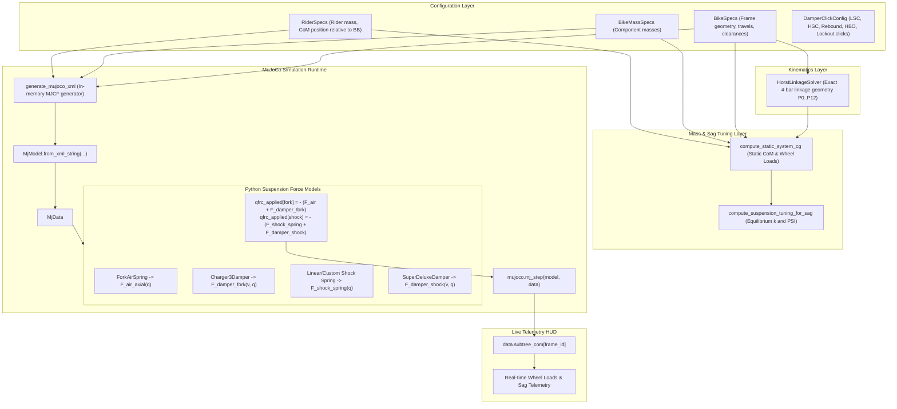

# Design Specification: 2D Suspension Physics, Kinematics & Telemetry Refactoring

**Date**: 2026-08-23  
**Status**: Approved by User  
**Scope**: Full physics engine unification, kinematic hardpoint synchronization, obstacle mass isolation, in-memory dynamic XML generation, rider center-of-mass alignment, and numerical domain protection.

---

## 1. Overview & Problem Statement

An extensive audit of the bicycle simulation project revealed several critical architectural and physical defects:
1. **Dual Suspension Force Baseline**: Suspension slide joints (`fork_travel`, `shock_stroke`) defined linear stiffness/damping in the MJCF XML baseline, while `run_playground.py` calculated nonlinear dynamic forces and applied a delta correction via `qfrc_applied`. Additionally, fork and rear shock were handled asymmetrically.
2. **Kinematic Hardpoint Desynchronization**: Hardpoint `P3` and shock yoke CoM in `mass_profile.py` were hardcoded with empirical offsets, creating a 75.5 mm error for `P3` and a 100 mm error for `pos_yoke` compared to `HorstLinkageSolver`.
3. **Stale XML Generation**: `run_playground.py` loaded pre-existing XML files from disk rather than rebuilding from updated Python specifications (`BikeSpecs`).
4. **Mass & Subtree CoM Corruption**: In Dynamic mode, mocap track obstacles lacked explicit zero mass, adding ~700 kg of spurious mass and shifting the world `subtree_com[0]` by ~28 meters forward, causing `front_load_pct` to clip at 100%.
5. **Rider Mass & Sag Tuning Disconnect**: Sag tuning assumed a constant `front_weight_fraction = 0.35`, ignoring the real physical rider anatomy and bike geometry.
6. **Silent Clamping of Invalid Volumes**: In `air_spring.py`, negative positive chamber volume was clamped to `1e-7 m^3`, generating pressures in gigapascals.

This specification unifies the simulation around MuJoCo as the sole dynamic integrator and Python models as the exact force generators.

---

## 2. Architecture & Data Flow

---

## 3. Detailed Component Specifications

### 3.1. Unified Suspension Forces (`export_mujoco.py` & `run_playground.py`)
- **MJCF Model**:
  - `fork_travel` joint: `stiffness="0"`, `damping="0"`, `springref="0"`.
  - `shock_stroke` joint: `stiffness="0"`, `damping="0"`, `springref="0"`.
- **Dynamic Mode Force Application**:
  - Fork: $F_{\text{total\_fork}} = F_{\text{air\_spring}}(q_{\text{fork}}) + F_{\text{charger3\_damper}}(v_{\text{fork}}, q_{\text{fork}})$.
    $$qfrc\_applied[\text{dof\_fork}] = - F_{\text{total\_fork}}$$
  - Rear Shock: $F_{\text{total\_shock}} = (q_{\text{shock}} \cdot k_{\text{shock}}) + F_{\text{super\_deluxe\_damper}}(v_{\text{shock}}, q_{\text{shock}})$.
    $$qfrc\_applied[\text{dof\_shock}] = - F_{\text{total\_shock}}$$
- **Stand Mode**:
  - Servos drive position directly without redundant spring compensation terms.

### 3.2. Dynamic In-Memory Model Compilation (`run_playground.py`)
- Remove static disk existence check (`if not stand_xml.exists()...`).
- `SuspensionPlayground.load_model(mode)` calls `generate_mujoco_xml(specs=self.specs, solver=self.solver, mode=mode)` and compiles via `mujoco.MjModel.from_xml_string(xml_str)`.
- CLI exporter `export_playground_models` remains available for exporting standalone XML files.

### 3.3. Obstacle Mass Isolation & Telemetry Cleanup (`export_mujoco.py` & `run_playground.py`)
- All obstacle geoms (`geom_obs_*`) get explicit `mass="0"` / `density="0"`.
- In `run_playground.py`:
  - `frame_id = mujoco.mj_name2id(self.model, mujoco.mjtObj.mjOBJ_BODY, "frame")`
  - Total bike/rider mass: `sum(self.model.body_mass[frame_id:])`
  - System CoM: `subtree_com = self.data.subtree_com[frame_id]`
  - Real-time axle loads computed from `subtree_com[frame_id]` against front axle and rear axle locations.

### 3.4. Synchronizing Kinematics with Mass Profile (`mass_profile.py`)
- `compute_component_centers_of_mass(specs, mass_specs, solver=None)`:
  - If `solver` is None, instantiate `HorstLinkageSolver(specs)`.
  - Obtain uncompressed reference state: `st0 = solver.solve_state_from_wheel_travel(0.0)`.
  - `p2 = st0["P2"] / 1000.0`
  - `p3 = st0["P3"] / 1000.0`
  - `pos_yoke = 0.5 * (st0["P4"] + st0["P6"]) / 1000.0`
- Remove all empirical offsets for kinematic linkages.

### 3.5. Rider Anatomy & Equilibrium Sag Tuning (`mass_profile.py` & `bike_geometry.py`)
- Define `RiderSpecs`:
  - `mass_kg: float = 80.0`
  - `torso_mass: float = 55.0`
  - `legs_mass: float = 18.0`
  - `arms_mass: float = 7.0`
  - `com_relative_bb: np.ndarray = np.array([0.15, 0.0, 0.65])`
- `compute_static_system_cg`:
  - Includes rider components in the uncompressed static CG calculation.
  - Produces true static front/rear load percentages ($\sim 46.9\% / 53.1\%$).
- `compute_suspension_tuning_for_sag`:
  - Default `front_weight_fraction` uses calculated `front_load_pct / 100.0` unless explicitly overridden.
  - Renames metrics:
    - `front_spring_force_full_travel_n`
    - `rear_spring_force_full_travel_n`
    - `fork_air_force_full_travel_n`

### 3.6. Air Spring Physical Domain Validation (`air_spring.py`)
- Replace silent volume clamping:
  - In `compute_volumes(travel_mm, num_tokens)`:
    If `v_disp >= v_pos_0`, raise `ValueError(f"Positive chamber volume exhausted at {travel_mm:.1f}mm travel with {tokens} tokens.")`.
  - In `calibrate_psi_for_sag`:
    If `delta_ratio <= 0.0`, raise `ValueError("Invalid sag calibration: negative chamber force exceeds positive chamber force.")`.

---

## 4. Verification Plan

### 4.1. Automated Unit Tests (`pytest`)
1. **`test_mjcf_compilation_all_modes`**: Validate that in-memory generated models compile without errors.
2. **`test_suspension_force_isolation`**: Verify that joint stiffness and damping are 0 in XML and that `qfrc_applied` delivers full dynamic force.
3. **`test_obstacle_mass_zero`**: Ensure mocap obstacles contribute 0 mass and that `subtree_com[frame_id]` corresponds exactly to bike+rider mass.
4. **`test_kinematic_hardpoints_consistency`**: Assert `P2`, `P3`, and `pos_yoke` in `mass_profile.py` match `HorstLinkageSolver` within $< 10^{-6}\text{ m}$.
5. **`test_air_spring_domain_validation`**: Assert `ValueError` is raised on excessive tokens / over-compression.
6. **`test_sag_tuning_consistency`**: Ensure sag calculation produces $< 5\%$ discrepancy when loaded in dynamic simulation.

### 4.2. End-to-End Dynamic Simulation Verification
- Run `run_playground.py` headlessly / for $N$ steps to confirm:
  - Stable cruising at 15 km/h.
  - Obstacle traversal without numerical divergence.
  - Live HUD telemetry displaying realistic mass ($\sim 104.5\text{ kg}$) and load distribution ($45\text{--}48\%$ front load).
