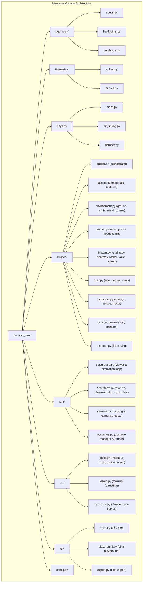
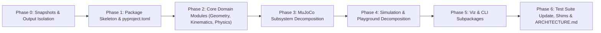

# Modular Architecture Refactoring Specification

> [!NOTE]
> **Project Goal**: Restructure the bicycle kinematics & MuJoCo simulation repository into a clean, modular Python package (`bike_sim`), decompose multi-thousand-line monolithic scripts into focused domain modules (100–300 lines each), isolate generated artifacts into `output/`, and provide an AI architecture guide (`docs/ARCHITECTURE.md`) to minimize LLM token consumption and improve navigation.

---

## 1. Motivation & Codebase Inventory

### 1.1 Existing Codebase Inventory
The repository currently contains **10 Python modules** at the root level alongside ~30 PNG images, 4 generated XML files, and 8 test files:

| Existing Source File | Line Count | Role in Current Codebase | Target in New Package |
|---|---|---|---|
| [`bike_geometry.py`](file:///Users/vladislav.molchanov/Desktop/Projects_my/mujoco_sim_new2/bike_geometry.py) | 361 | Geometric specs, fixed frame hardpoints, trail | `src/bike_sim/geometry/` (`specs.py`, `hardpoints.py`) |
| [`linkage_solver.py`](file:///Users/vladislav.molchanov/Desktop/Projects_my/mujoco_sim_new2/linkage_solver.py) | 641 | Horst-link 4-bar vector loop solver & curves | `src/bike_sim/kinematics/` (`solver.py`, `curves.py`) |
| [`mass_profile.py`](file:///Users/vladislav.molchanov/Desktop/Projects_my/mujoco_sim_new2/mass_profile.py) | 494 | Component mass specs, inertia matrix, static CG | `src/bike_sim/physics/mass.py` |
| [`air_spring.py`](file:///Users/vladislav.molchanov/Desktop/Projects_my/mujoco_sim_new2/air_spring.py) | 388 | Dual-chamber progressive air spring model | `src/bike_sim/physics/air_spring.py` |
| [`suspension_damper.py`](file:///Users/vladislav.molchanov/Desktop/Projects_my/mujoco_sim_new2/suspension_damper.py) | 527 | Damper dyno model & velocity-force curves | `src/bike_sim/physics/damper.py` |
| [`bike_config.py`](file:///Users/vladislav.molchanov/Desktop/Projects_my/mujoco_sim_new2/bike_config.py) | 29 | Composite bike configuration schema | `src/bike_sim/config.py` |
| [`plot_damper_dyno.py`](file:///Users/vladislav.molchanov/Desktop/Projects_my/mujoco_sim_new2/plot_damper_dyno.py) | 212 | Damper dyno curve plotting utility | `src/bike_sim/viz/dyno_plot.py` |
| [`export_mujoco.py`](file:///Users/vladislav.molchanov/Desktop/Projects_my/mujoco_sim_new2/export_mujoco.py) | **2,829** | Monolithic XML generator, geoms, assets, equality | **Decompose $\rightarrow$ `src/bike_sim/mujoco/` (8 sub-modules)** |
| [`run_playground.py`](file:///Users/vladislav.molchanov/Desktop/Projects_my/mujoco_sim_new2/run_playground.py) | **1,531** | Monolithic interactive GLFW simulation playground | **Decompose $\rightarrow$ `src/bike_sim/sim/` (4 sub-modules)** |
| [`main.py`](file:///Users/vladislav.molchanov/Desktop/Projects_my/mujoco_sim_new2/main.py) | **1,314** | CLI entry, terminal tables, matplotlib plots | **Decompose $\rightarrow$ `src/bike_sim/viz/` & `src/bike_sim/cli/`** |

### 1.2 Identified Problems
1. **Context Bloat**: Inspecting or editing MuJoCo visual geoms, simulation controllers, or plotting routines requires loading massive files (`export_mujoco.py` is ~30k tokens; `run_playground.py` is ~18k tokens).
2. **Root Clutter**: ~30 loose `.png` files (dyno curves, linkage plots, photographic calibration crops) and 4 `.xml` files pollute the root directory.
3. **Implicit Dependencies**: `glfw` and `scipy` are utilized in code and present in `.venv`, but missing from `pyproject.toml` dependencies.

---

## 2. Target Package Architecture (`src/bike_sim`)



### Complete Target Directory Layout

```
mujoco_sim_new2/
├── pyproject.toml                     # Standard package metadata, dependencies & scripts
├── AGENTS.md / CLAUDE.md              # Fast lookup instructions for LLM coding agents
├── docs/
│   ├── ARCHITECTURE.md                # 1-page index of all modules, responsibilities & APIs
│   ├── reference/                     # Photographic reference and overlay images
│   └── superpowers/specs/...          # Architectural specifications
├── output/                            # Output directory for generated artifacts
│   ├── .gitignore                     # Ignores generated PNG, XML, TXT, JSON outputs
│   ├── plots/                         # Generated curves & comparison images
│   └── models/                        # Generated MJCF XML models
├── src/
│   └── bike_sim/
│       ├── __init__.py                # Top-level public API exports
│       ├── config.py                  # BikeConfig composite schema
│       ├── geometry/
│       │   ├── __init__.py
│       │   ├── specs.py               # BikeSpecs dataclass & defaults
│       │   ├── hardpoints.py          # get_fixed_frame_points, compute_front_axle, compute_trail
│       │   └── validation.py          # Geometry sanity assertions
│       ├── kinematics/
│       │   ├── __init__.py
│       │   ├── solver.py              # HorstLinkageSolver 4-bar analytical loop solver
│       │   └── curves.py              # Leverage ratio, anti-squat, axle path, progression
│       ├── physics/
│       │   ├── __init__.py
│       │   ├── mass.py                # BikeMassSpecs, RiderSpecs, mass/inertia/CG
│       │   ├── air_spring.py          # AirSpringSpecs, AirSpringModel (dual-chamber)
│       │   └── damper.py              # DamperSpecs, DamperModel (velocity-force curves)
│       ├── mujoco/
│       │   ├── __init__.py
│       │   ├── builder.py             # Top-level generate_mujoco_xml orchestrator
│       │   ├── assets.py              # Materials, textures, visual quality settings
│       │   ├── environment.py         # Ground, lighting, terrain obstacles, stand fixtures
│       │   ├── frame.py               # Frame tubes, BB, headset, pivots visual geoms
│       │   ├── linkage.py             # Chainstay, seatstay, rocker, yoke, wheels, equality constraints
│       │   ├── rider.py               # Rider body segments & mass distribution
│       │   ├── actuators.py           # Spring/damper actuators, wheel servos, drive motor
│       │   ├── sensors.py             # Travel, force, velocity, acceleration sensors
│       │   └── exporter.py            # File export helpers (export_mujoco, export_json)
│       ├── sim/
│       │   ├── __init__.py
│       │   ├── playground.py          # SuspensionPlayground core loop & GLFW setup
│       │   ├── controllers.py         # Stand servo controller, dynamic rider controller
│       │   ├── camera.py              # CameraManager (tracking, camera views)
│       │   └── obstacles.py           # ObstacleManager & ObstacleEntry
│       ├── viz/
│       │   ├── __init__.py
│       │   ├── plots.py               # Matplotlib linkage geometry, leverage, comparison plots
│       │   ├── tables.py              # Terminal formatted tables (kinematics summary)
│       │   └── dyno_plot.py           # Damper dyno curve visualizer
│       └── cli/
│           ├── __init__.py
│           ├── main.py                # bike-sim CLI
│           ├── playground.py          # bike-playground CLI
│           └── export.py              # bike-export CLI
├── tools/                             # Optimization & reference tools
│   ├── __init__.py
│   ├── fit_hardpoints.py
│   ├── photo_reference.py
│   └── render_comparison.py
└── tests/                             # Pytest test suite (95 tests across 8 suites)
    ├── __init__.py
    ├── test_air_spring.py
    ├── test_fitted_hardpoints.py
    ├── test_frame_visuals.py
    ├── test_kinematics.py
    ├── test_mass_distribution.py
    ├── test_photo_reference.py
    ├── test_playground.py
    └── test_render_comparison.py
```

---

## 3. Detailed Component Breakdown & Responsibilities

### 3.1 Domain Modules (Geometry, Kinematics, Physics, Config)
- **`geometry/specs.py`**: `BikeSpecs` dataclass containing frame reach, stack, head angle, BB drop, pivot coordinates.
- **`geometry/hardpoints.py`**: `get_fixed_frame_points()`, `compute_front_axle()`, `compute_trail()`.
- **`geometry/validation.py`**: `validate_geometry()`.
- **`kinematics/solver.py`**: `HorstLinkageSolver` implementing closed-form trigonometric & 4-bar vector loop equations (`solve_state_from_wheel_travel`, `solve_state_from_shock_stroke`).
- **`kinematics/curves.py`**: Calculations for leverage ratio, progression %, axle path $(x, z)$, anti-squat, and instant center.
- **`physics/mass.py`**: `BikeMassSpecs`, `RiderSpecs`, per-body mass distribution, wheel rotational inertia, static & dynamic CG calculations.
- **`physics/air_spring.py`**: `AirSpringSpecs`, `AirSpringModel` (dual-chamber progressive air spring kinematics and thermodynamics).
- **`physics/damper.py`**: `DamperSpecs`, `DamperModel` (high/low speed compression & rebound damping forces).
- **`config.py`**: `BikeConfig` combining geometry, mass, spring, and damper specifications.

### 3.2 MuJoCo Subsystem Decomposition (`export_mujoco.py` $\rightarrow$ 8 Modules)
- **`mujoco/builder.py`**: `generate_mujoco_xml()` coordinating the assembly in deterministic sequence:
  1. Header & simulation options (`option` with timestep based on mode).
  2. Assets & visual (`assets.py`).
  3. Environment, lights, ground (`environment.py`).
  4. Frame body & fixed attachments (`frame.py`).
  5. Suspension linkage bodies, rear wheel & equality constraints (`linkage.py`).
  6. Rider geometry & mass bodies (`rider.py`).
  7. Actuators & wheel servos (`actuators.py`).
  8. Sensors (`sensors.py`).
  9. Keyframes (zero, sag, bottom-out).
- **`mujoco/assets.py`**: Builds `<asset>` (materials, grid textures, skybox) and `<visual>` tags.
- **`mujoco/environment.py`**: Builds ground plane, directional lights, test stand fixture geoms, terrain obstacles.
- **`mujoco/frame.py`**: Frame body (`worldbody/body[@name='frame']`), downtube, toptube, seattube, headtube, shock mounts, handlebars, saddle.
- **`mujoco/linkage.py`**: Chainstay, seatstay, rocker link, yoke, wheels, joints (`hinge`, `slide`), and `<equality>` loop closure constraints (`connect`, `weld`).
- **`mujoco/rider.py`**: Rider visual bodies (head, torso, upper/lower arms, legs) and mass placement.
- **`mujoco/actuators.py`**: `<actuator>` elements (suspension spring/damper, drive motor, steering, stand position servos).
- **`mujoco/sensors.py`**: `<sensor>` elements (wheel travel, shock stroke, accelerations, forces).
- **`mujoco/exporter.py`**: `export_mujoco()`, `export_playground_models()`, `export_json()`.

### 3.3 Simulation Subsystem Decomposition (`run_playground.py` $\rightarrow$ 4 Modules)
- **`sim/playground.py`**: Core `SuspensionPlayground` class, main loop, GLFW window setup, keyboard callbacks, telemetry HUD overlay.
- **`sim/controllers.py`**: Stand mode position servos, dynamic rider stabilization PID, cruise control, obstacle traversal.
- **`sim/camera.py`**: `CameraManager` for smooth tracking, preset views (isometric, side, suspension close-up).
- **`sim/obstacles.py`**: `ObstacleManager`, `ObstacleEntry`, procedural obstacle positioning.

### 3.4 Visualization & CLI Subsystems (`main.py` & `plot_damper_dyno.py` $\rightarrow$ 5 Modules)
- **`viz/plots.py`**: Matplotlib plotting routines (`plot_linkage_geometry`, `plot_leverage_ratio`, `plot_suspension_compressed_comparison`).
- **`viz/tables.py`**: Terminal summary tables of kinematics metrics and hardpoint coordinates (`print_tables`).
- **`viz/dyno_plot.py`**: Damper dyno curve visualizer (`plot_damper_dyno`).
- **`cli/main.py`**: Main CLI entrypoint (`bike-sim`).
- **`cli/playground.py`**: Interactive simulation CLI (`bike-playground`).
- **`cli/export.py`**: Direct model exporter CLI (`bike-export`).

---

## 4. Packaging & Dependencies (`pyproject.toml`)

```toml
[project]
name = "bike-sim"
version = "0.2.0"
description = "Bicycle suspension kinematics solver and MuJoCo simulation model generator"
readme = "README.md"
requires-python = ">=3.10"
dependencies = [
    "numpy>=1.24.0",
    "matplotlib>=3.7.0",
    "mujoco>=3.0.0",
    "scipy>=1.17.0",
    "glfw>=2.10.0",
    "pytest>=7.0.0",
]

[project.scripts]
bike-sim = "bike_sim.cli.main:main"
bike-playground = "bike_sim.cli.playground:main"
bike-export = "bike_sim.cli.export:main"

[build-system]
requires = ["setuptools>=61.0"]
build-backend = "setuptools.build_meta"

[tool.setuptools.packages.find]
where = ["src"]
```

---

## 5. Behavioral Equivalence & Verification Plan

### 5.1 Pre-Refactoring Snapshots (Phase 0)
Before any source file is moved or modified:
1. Generate and save golden reference models to temporary storage:
   - `bike_model.xml`
   - `bike_playground.xml`
   - `coordinates.json`
2. Capture full test execution output (`uv run pytest`) verifying all 95 tests pass.

### 5.2 Post-Refactoring Equivalence Checks
1. **Exact/Semantic XML Match**:
   - Verify `generate_mujoco_xml()` in `bike_sim.mujoco.builder` produces XML identical in element tags, attributes, and numerical values to the golden snapshot.
2. **Coordinates & Kinematics Parity**:
   - Verify `coordinates.json` hardpoints match pre-refactoring coordinates to 6 decimal places.
3. **Full Pytest Suite**:
   - All 95 tests across the 8 test files (`test_air_spring.py`, `test_fitted_hardpoints.py`, `test_frame_visuals.py`, `test_kinematics.py`, `test_mass_distribution.py`, `test_photo_reference.py`, `test_playground.py`, `test_render_comparison.py`) must pass with 0 failures:
     ```bash
     uv run pytest
     ```
4. **CLI Smoke Tests**:
   - `uv run bike-sim --help`
   - `uv run bike-export`
   - `uv run bike-playground --mode stand` (headless / smoke test)

---

## 6. Phased Execution Plan



- **Phase 0: Baseline Snapshots & Output Directory Setup**
  - Create `output/plots/`, `output/models/`, `output/.gitignore`.
  - Capture golden snapshots of `bike_model.xml`, `coordinates.json`, and pytest results.
  - Move root `.png` plots and generated `.xml` files to `output/`.

- **Phase 1: Package Skeleton & Build System**
  - Create `src/bike_sim/` directory structure with subpackage `__init__.py` files.
  - Update `pyproject.toml` with `src` layout, dependencies, and CLI script entry points.
  - Install editable package via `uv pip install -e .`.

- **Phase 2: Core Domain Modules Migration**
  - Migrate `bike_geometry.py` $\rightarrow$ `src/bike_sim/geometry/` (`specs.py`, `hardpoints.py`, `validation.py`).
  - Migrate `linkage_solver.py` $\rightarrow$ `src/bike_sim/kinematics/` (`solver.py`, `curves.py`).
  - Migrate `mass_profile.py`, `air_spring.py`, `suspension_damper.py` $\rightarrow$ `src/bike_sim/physics/`.
  - Migrate `bike_config.py` $\rightarrow$ `src/bike_sim/config.py`.

- **Phase 3: MuJoCo Subsystem Decomposition**
  - Break down `export_mujoco.py` into `src/bike_sim/mujoco/` (8 focused modules + `__init__.py`).
  - Verify XML output against Phase 0 snapshot.

- **Phase 4: Simulation Subsystem Decomposition**
  - Break down `run_playground.py` into `src/bike_sim/sim/` (`playground.py`, `controllers.py`, `camera.py`, `obstacles.py`).

- **Phase 5: Visualization & CLI Subsystems**
  - Break down `main.py` & `plot_damper_dyno.py` into `src/bike_sim/viz/` and `src/bike_sim/cli/`.

- **Phase 6: Test Suite Alignment, Compatibility Shims & AI Guide**
  - Update import statements in all 8 test files (`from bike_sim...`).
  - Run full test suite (`uv run pytest`) and ensure all 95 tests pass.
  - Create `docs/ARCHITECTURE.md` as a zero-shot index for AI navigation.
  - Update `AGENTS.md` and `CLAUDE.md`.
