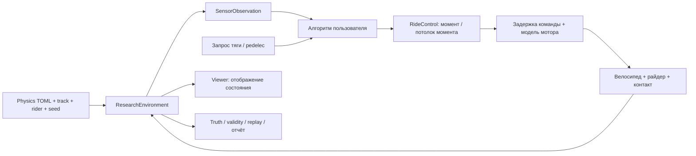

# Стенд для разработки anti-wheelie: целевая модель и критерии готовности

Дата: 2026-10-01. Исходная ревизия аудита: `antiwheelie-refocus`, `3f94874`.

## 1. Результат для пользователя

Пользователь разрабатывает свой алгоритм ограничения момента двигателя. Проект предоставляет воспроизводимый велосипед с райдером, пересечённую дорогу, измерения датчиков, реалистичный путь команды к мотору и независимую оценку последствий. Сам алгоритм anti-wheelie в этот этап **не входит**; пользователь подтвердил это 2026-10-01.

Основной существующий сценарий:

```bash
uv run bike-ride \
  --physics-config examples/research/viewer_physics_fast.toml \
  --rider articulated_planar \
  --track examples/research/rough_uphill_extreme.toml
```

Нужно сохранить этот запуск и дать ему исследовательский вариант с тем же велосипедом, райдером и трассой. Пользователь должен иметь возможность запустить свою политику с окном, без окна, серией экспериментов и по сохранённой записи. Изменение частоты рисования не должно изменять физику или частоту управления.

## 2. Что установлено по текущим исходникам

Аудит был статическим: тесты, симуляции и GUI в этой сессии не запускались. Сохранённые отчёты использованы как указатели проблем, не как подтверждение текущей ревизии.

| Есть и переиспользуется | Недостающая связь или проверка |
|---|---|
| `RideControl`, ограничения и динамика двигателя | Общий пользовательский policy runner для viewer и headless |
| `ResearchEnvironment`, задержка команд, truth, события, validity gates | `bike-ride` работает через другую сессию и в GUI включает preview без энергетического аудита |
| `resolve_research_physics` | `bike-research` не принимает `--physics-config` и не вызывает этот resolver |
| `SensorPipeline` с шумом и задержкой | Частота приобретения измерений привязана к `env.step`; тесты уже требуют отдельные часы, bias, dropout, age |
| `replay.py` и тесты replay | `env.save()` не создаёт replay bundle и не сохраняет начальное integration state |
| События wheelie, continuous front-load metrics, demand, генератор, batch | Старый план ошибочно сообщает, что всё это ещё не реализовано |
| Баланс райдера, ограничения хвата/суставов/мощности, activation | Часть ограничений выключена в пользовательском fast-профиле; нужен квалифицированный набор параметров |
| Distributed contact и geometric ideal transmission | Оба остаются экспериментальными; существование реализации не означает пригодность целевого проезда |

Статус «Tasks 1–7: none started» в изменённом пользователем `2026-09-30-antiwheelie-plant-refocus.md` устарел. Этот файл и имеющиеся результаты не перезаписывать. Новые планы описывают продолжение от текущего кода.

Дополнение пользователя: ноги отделяются от педалей и велосипед не доезжает наверх. В последнем найденном preview первая большая потеря контакта происходит при переходе на накат ещё на плоскости, затем опора возвращается. Поздняя остановка около 56 м происходит с нагруженными педалями. Поэтому первый обязательный блок работ — воспроизведение и исправление coast/contact failure и отдельная диагностика climb stall. Текущую причину не объявлять установленной по одному старому логу.

## 3. Граница детализации

| Сохраняем и проверяем | Упрощаем или не развиваем |
|---|---|
| Масса, общий центр масс, инерция тангажа и вращение колёс | Крен, рыскание, руление и боковое сцепление |
| Свободный тангаж велосипеда, перенос нагрузки, передняя и задняя подвеска | Косметическая геометрия и визуальная отделка |
| Динамическая поза райдера, реакции рук/ног/седла, конечные усилия | Физиология мышц и интеллектуальные рефлексы райдера |
| Результирующие силы и моменты контакта на буграх, корнях и ступенях | Полная деформация покрышки, грунта и следов колёс |
| Передаточное отношение, свободный ход, реакция мотора и значимая связь привода с подвеской | Колебания звеньев цепи, натяжитель, подробное зацепление |
| Пределы/динамика момента, задержки, ограничения мощности, поведение на старте/остановке | Детальная электрическая модель, если она не меняет момент в исследуемом режиме |
| Часы и качество доступных алгоритму датчиков | Передача алгоритму идеальных сил контакта или будущей дороги |

`elastic_chain` остаётся замороженным диагностическим сравнением. Совпадение с ним само по себе не является доказательством истины. Упрощённый привод проверяется по виртуальной работе, реакциям, сохранению импульса, численной сходимости и влиянию на переднюю нагрузку.

В имеющихся A/B-отчётах plain `ideal_mid_drive` изменяет минимум передней нагрузки примерно на 30% на подъёме; geometric-вариант имеет неуспешные прогоны. Поэтому нельзя сейчас назначить один из них достоверным по названию или скорости. Корневую причину отказов geometric-варианта этот аудит не установил.

## 4. Архитектура



Первый исследовательский viewer использует полный `ResearchEnvironment`, а не preview. Это позволяет проверить один путь исполнения до оптимизации. Preview остаётся быстрым просмотром с явным статусом `not_evaluated`; он не участвует в приёмке физики. Производительность улучшают сокращением частоты рендера и необязательной записи, затем профилированием. Пропуск физических шагов и изменение `dt` ради FPS недопустимы.

Политика имеет фабрику без аргументов, `reset(seed: int)` и `act(observation: SensorObservation, demand_nm: float | None) -> RideControl`. Вход `None` означает режим настроенного pedelec. Простейшее пропускание помощи возвращает `RideControl()`; ограничитель возвращает `RideControl(motor_limit_nm=...)`. Числовой `motor_torque_nm` — отдельный режим внешнего запроса на валу mid-drive в Н·м. Команда политики не задаёт усилие или позу райдера. Райдер — независимо воспроизводимое возмущение.

Для исследовательского запуска `bike-ride` получает флаг `--research`, а policy — `--policy module:factory`. Без policy используется прозрачное пропускание входа, не алгоритм anti-wheelie. `--headless` выбирает лишь способ отображения. В исследовательском режиме изменения параметров велосипеда клавишами запрещены до reset; тормоз оператора допускается, записывается и отмечает проезд как вмешательство оператора.

## 5. Датчики, время и воспроизведение

- Физика, приобретение измерений, управление и rendering имеют разные часы. Все периоды, отображаемые на шаги физики, проверяются на целочисленную кратность.
- Базовые часы: control 10 мс, sensor 5 мс, command transport 5 мс, sensor latency 10 мс. Они совместимы с сеткой `1.25 / 0.625 / 0.3125` мс. API сохраняет возможность 1 мс acquisition при совместимом `dt`; несовместимость — явная ошибка.
- IMU выдаёт proper acceleration и pitch-rate; энкодеры — скорости колёс и кривошипа; torque channels — измеренный моторный/человеческий момент. Истинный pitch, уклон, CoM, load и clearance доступны только оценщику.
- Сэмпл имеет source time, delivery time и validity. Задержка не превращает исходно невалидное измерение в валидное; dropout удерживает последнее измерение только до maximum age.
- Шум и dropout используют фиксированные независимые RNG streams, чтобы выключение одного эффекта не сдвигало остальные.
- Reset сбрасывает состояние политики, очереди, RNG, счётчики, метрики и время.
- Replay пересоздаёт исходную модель и материальные состояния, проверяет начальное состояние и повторяет записанные входы; он не маскирует различия начальных условий телепортацией.
- Запись включает effective config, source/config/terrain hashes, runtime versions, input programs, политику и её исходный hash, commands, observations, transitions, state snapshots, validity и причину завершения. Сначала сохранить отказ, затем вернуть ненулевой статус ошибки.

## 6. Физическая область и различимые исходы

Базовая область: продольное движение по твёрдой пересечённой поверхности, артикулированный райдер, mid-drive, старт с нуля. Целевой набор содержит плоскость; 5/12/20/28/35% подъёмы; разгон; накат и возобновление; бугор; вершину; 4/6 см ступени; два одновременных контакта одной шины; полёт и приземление; четыре позы; переключение; откат; пользовательскую 100-метровую трассу. 35% — grade, не градусы.

Физически допустимые результаты: finish, stall, loss of traction, lift, flight, rider-contact failure, loop-out и endo. Срабатывание model-scope или numerical gate — отдельный invalid результат. Невозможность проехать 35% при заданных мощности и сцеплении не исправляется увеличением тяги, телепортацией или внешним стабилизатором.

Подъём переднего колеса от рельефа не автоматически является моторным wheelie. Оценщик показывает опору сзади, front clearance, road-relative pitch, pitch rate и контекст момента. Для сравнения алгоритмов используются парные проезды с одинаковыми трассой, начальными условиями, запросом тяги и программой райдера.

Политика с нулевым моментом не объявляется лучшей лишь потому, что нет wheelie: рядом показываются пройденная дистанция, время, остановки и недопоставленная запрошенная тяга. Для pedelec, где будущий assist demand зависит от траектории, интеграл demand — телеметрия, а не общий для разных политик независимый знаменатель. Парные сравнения с заданным `DemandProgram` используют действительно одинаковый внешний запрос.

## 7. Проверка достоверности

Три отдельных уровня: `preview`, `numerically_verified_synthetic`, `validated_within_declared_scope`. В этом этапе обязательна синтетическая модель с проверенной механикой и численной сходимостью. Последний уровень требует реальных измерений и независимых holdout-проездов; таких данных сейчас не предоставлено. Это ограничение результата, а не причина откладывать рабочий стенд.

Использовать существующие механические стенды и критерии `validation/fidelity_sweep.py`: различие импульсов/средних и минимальных нагрузок ≤2%, ходов подвески ≤1 мм, peak pitch-rate ≤5%, времени совпадающих событий ≤5 мс. Энергетический residual ≤0.05. Эти числа — заранее выбранные инженерные критерии, не измеренная ошибка реального велосипеда.

Временная, дорожная и контактная дискретизации проверяются независимо. Во временном sweep постоянная closure остаётся 2.5 мс. Для интеграторного сравнения начальные условия одинаковы, включая внешнее состояние материалов; для изменения контактного backend начальное равновесие сравнивается отдельными физическими метриками. Нельзя объявлять сходимость по совпавшим ранним отказам.

Профиль выпускается только для точного проверенного сочетания параметров, `dt`, road resolution, tire backend/stations и drivetrain. Если ни один вариант не прошёл, исполнитель продолжает локализацию и исправление с минимальным воспроизводимым тестом; выпуск профиля остаётся незавершённым. Нельзя заменить неудачу снижением требований или молчаливым исключением ступеней из целевой области.

## 8. Global Constraints

- Python >=3.13; every Python command uses `uv`; no new runtime dependencies.
- Work only in this checkout; preserve existing dirty/staged/untracked files and previous verification artifacts.
- Do not commit, change branches, or change default profiles without explicit user authorization.
- Do not implement or tune the user's anti-wheelie algorithm.
- Retain planar X-Z dynamics, articulated rider, mid-drive torque units, and the sensor/truth boundary.
- Do not extend detailed-chain physics; do not add external pitch stabilization or runtime qpos/qvel corrections.
- Keep energy residual limit 0.05 and existing model-scope rejection; failed/incomplete runs cannot pass release gates.
- Preserve the existing preview command; research runs opt in explicitly and use the same core as headless runs.
- All newly created evidence uses a new output directory, source/config hashes and runtime versions.
- Never describe synthetic verification as measured real-bicycle validation.

## 9. План выполнения и определение готовности

1. **Сначала Task B1** из [плана B](../plans/2026-10-01-02-antiwheelie-plant-qualification.md): отрыв ног, восстановление педалирования, причина остановки. Эта задача использует существующий runtime и не зависит от A.
2. [План A — единый исследовательский запуск](../plans/2026-10-01-01-antiwheelie-research-workflow.md): конфигурация, датчики, replay, policy session, viewer/headless/batch. Самостоятельный результат — работающий инструмент с честным статусом качества модели.
3. **Затем Tasks B2–B4** из [плана B](../plans/2026-10-01-02-antiwheelie-plant-qualification.md): источник доказательств, контакт/привод, сходимость, парные эксперименты, финальный профиль.

Готовность требует: одна policy factory работает в GUI/headless; конфигурации и входы совпадают; датчики независимы от FPS/control frequency; replay воспроизводит результат; есть хотя бы один проверенный полный 15-секундный устойчивый проезд; целевой сценарий 100 м получает честный объяснимый исход в пределах 90 с; все целевые механические и numerical gates пройдены; invalid результаты не попадают в успешную статистику; README содержит проверенные команды; исходный пользовательский preview сохранён. Быстрый профиль не получает статус reference автоматически.

## 10. Основания моделирования

MuJoCo описывает силы ограничений через транспонированный Jacobian и отдельно вводит дискретизацию динамики; это основание проверять виртуальную работу и сходимость независимо: [Computation](https://mujoco.readthedocs.io/en/stable/computation/index.html#general-framework). Ограничения и contact compliance зависят от параметров модели: [Modeling](https://mujoco.readthedocs.io/en/stable/modeling.html). Выбор конкретных допусков и области применения выше — проектное решение, а не гарантия из документации движка.
